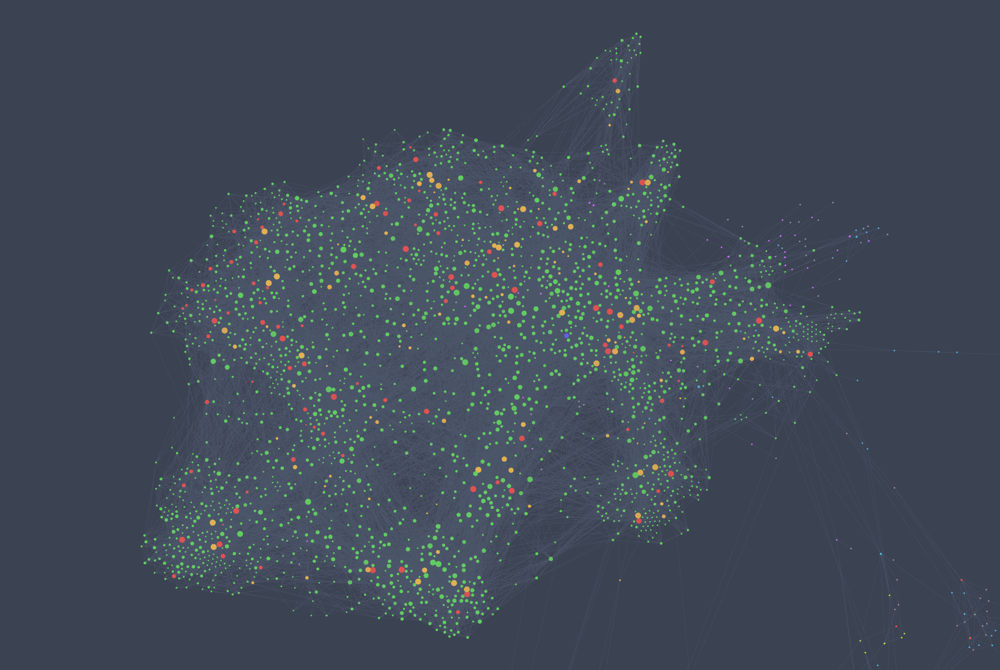

# Notes for Self-Study 

## Purpose

This repository is the latex-based notes for self-learning, mainly for math, statistics and machine learning.

## Knowledge Graph

## Obsidian Graph

  
  

## Obsidian 3D Graph

  

[Link to Animation](https://youtu.be/XVmD8URNH9s)

## Adjacency Matrix

  

## Table of Contents
- [Boosting Methods](./self-study/boosting_methods/README.md)

- [Causal Inference](./self-study/causal_inference/README.md)

- [Concentration Inequalities and Non-Asymptotic Analysis](./self-study/concentration_measures/README.md)

- [Deep Learning](./self-study/deep_learning)

- [Differential Geometry](./self-study/differential_geometry/README.md)

- [Functional Analysis](./self-study/functional_analysis/README.md)

- [Information Geometry and Optimal Transport](./self-study/information_geometry_optimal_transport/README.md)

- [Measure Theory, Abstract Integration, Probability Theory](./self-study/probability_and_measure_theory/README.md)

- [Monte Carlo Methods](./self-study/monte_carlo_methods/README.md)

- [Natural Language Processing](./self-study/natural_language_processing/README.md)

- [Peronsal Development](./self-study/personal_developments/README.md)

- [Probabilistic Graphical Models](./self-study/probabilistic_graphical_model/README.md)

- [Reinforcement Learning](./self-study/reinforcement_learning/README.md)

- [Stochastic Process and Statistical Analysis in Infinite Dimensional Space](./self-study/stochastic_process/README.md)

- [Statistical Learning Theory](./self-study/statistical_learning_theory/README.md)

- [Topology](./self-study/topology/README.md)

- [Other Topics](./self-study/selected_topics)
