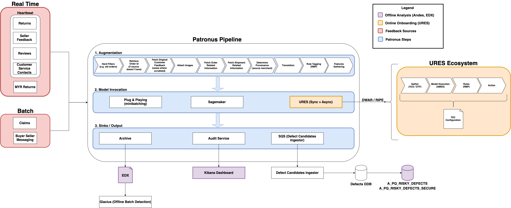

---
tags:
  - project
  - reference
  - wiki
  - customer_service_contact
aliases:
  - 1001cspatronus01
date of note: 2024-02-27
name: "Patronus: real time contact streaming"
---
## Patronus High Level

>[!info] 
>At its most fundamental level, Patronus follows the **GMRA (gather - model - rules - action) pattern**. Check on [[URES workflow]] for GMRA.

The processes within Patronus can be broken down by the following:

1. Ingest customer feedback sources
    1. Reviews
    2. Returns
    3. MYR Returns
    4. Claims
    5. Buyer Seller Messaging
    6. Customer Service Contacts
    7. Seller Feedback
2. **Augment** data for models
3. Run **rules** 
4. Send records for model invocation 
5. Send **results** to downstream sources

The in-depth step-by-step processes completed by Patronus can be found [here](https://quip-amazon.com/iqJDAya6bcre/Everything-Patronus-Does)

![[Patronus_high_level_design.png]]

>[!Note]
> Patronus is a record-by-record processing platform using [**Apache Flink**](https://flink.apache.org/flink-architecture.html) as the main framework and Kinesis as the data stream. Patronus has three main functions as the main defect detection pipeline: 
> 1) augmentation and hydration of customer feedback with the necessary information needed to pinpoint back to sourcing merchant and features necessary for defect detection models
> 2) execution of defect detection models
> 3) propagation of events down to downstream services

>[!Note] Note on the data cadance
> - When **Add customer feedback records into Kinesis**, there are three mechanisms:
> 	a. **Slapshot** (Heartbeat)
> 	- Functions as a fancy publisher-subscriber model with various nodes to do transforming prior to publishing.
> 	- Sources: **Returns**, **Reviews**, Seller Feedback, **CS Contacts**
> 	- Cadance: **Near-realtime stream**
> 	  
> 	b. **Cradle** (Dryad)
> 	- SQL Query is used to dump events from a table into Kinesis
> 	- Sources: **BSM (Buyer Seller Messaging)**, Claims
> 	- Cadence: **Daily**
> 
> 	c. **SQS → Lambda**
> 	- The lambda publishes to Kinesis and the SQS queue is subscribed to the SNS topic of the MYR team for MFN returns.
> 	- Sources: **MFN Returns**
> 	- Cadance: **Near-realtime stream**
> 

## The Design overall architecture:

## Detailed Design:

![[Patronus_pipeline_2.png]]