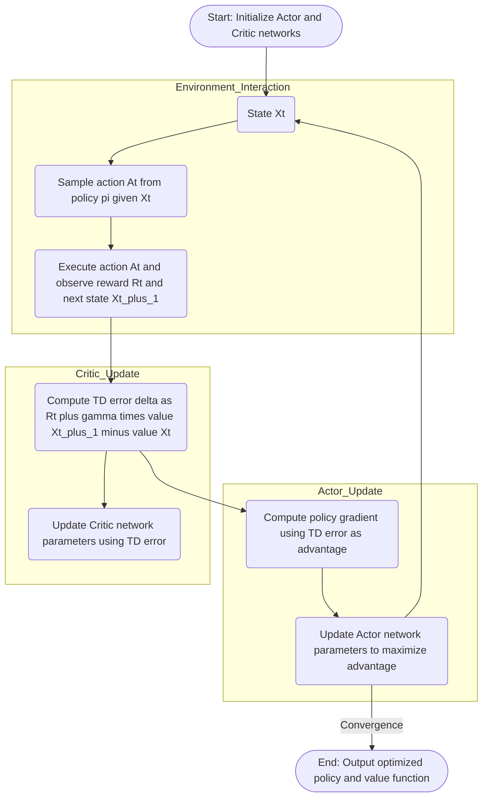

---
tags:
  - concept
  - machine_learning/algorithms
  - reinforcement_learning/theory
  - reinforcement_learning/algorithm
  - actor_critic_algorithm
keywords:
  - actor_critic_algorithm
topics:
  - reinforcement_learning/theory
  - reinforcement_learning/algorithm
name: Actor-Critic Algorithm
date of note: 2024-05-12
---

## Concept Definition

>[!important]
>**Name**: Actor-Critic Algorithm

### Objective Function

![[Value Function and Bellman Equation for MDP#^7cf44e]]

![[Gradient Monte Carlo Method for Value Function Approximation#^00a8b6]]

>[!important] Definition
>The **objective** of **Actor-Critic** algorithm is to *maximize the value*
>$$
>\begin{align*}
> &\max_{\pi}v_{\pi}(x) \\[5pt]
> &= \max_{\pi}\left\{   \sum_{a \in \mathcal{A}}\pi(a | x; \theta) \sum_{r\in R}\sum_{u \in \mathcal{X}}\,p(u, r | x, a)\,\left[r+ \gamma\,v_{\pi}(u)  \right] \right\} \\[5pt]
> &=  \max_{\pi}\left\{ \mathbb{E}_{A \sim \pi(\cdot|x) }\left[  \mathbb{E}_{ X',\,R \sim p(\cdot|\,x, A) }\left[ R + \gamma\,v_{\pi}(X')  \right] \right]  \right\}  \\[5pt]
> &=  \max_{\pi}\left\{ \mathbb{E}_{A \sim \pi(\cdot|x) }\left[  \mathbb{E}_{ X',\,R \sim p(\cdot|\,x, A) }\left[ R + \gamma\,\hat{v}(X'; w)  - \gamma\,\left(\hat{v}(X'; w)  - v_{\pi}(X')\right)  \right] \right]  \right\}  \\[5pt]
> &\approx \max_{\pi}\left\{  \mathbb{E}_{A \sim \pi(\cdot|x) }\left[  \mathbb{E}_{ X',\,R \sim p(\cdot|\,x, A) }\left[ R + \gamma\,\hat{v}(X'; w)  \right] \right] \right\}
>\end{align*}
>$$
>where $\hat{v}(x; w)$ approximate the value function $v_{\pi}(x)$ by *minimizing the mean squared error*
>$$
>  \min_{w}\;\lVert \hat{v}(X'; w)  - v_{\pi}(X')  \rVert_{2}^2 
>$$
>- Without knowing the *environment transition* $p(x', r| x, a)$, we can use the **Monte Carlo sampling** $$X', R \sim p(x', r| x, A), \quad \text{where }A \sim \pi(\cdot|x; \theta)$$ to approximate the objective function.
>- For *parameterized policy* $\pi(a|x, \theta)$, we  use the **gradient ascent algorithm** $$\theta \leftarrow \theta + \alpha\,\nabla_{\theta}\;\mathbb{E}_{A \sim \pi(\cdot|x; \theta) }\left[  \mathbb{E}_{ X',\,R \sim p(\cdot|\,x, A) }\left[ R + \gamma\,\hat{v}(X'; w)  \right] \right] $$
>- The **REINFORCE algorithm** provides the principle for computing the **gradient** of objective function via *Monte Carlo* 
>$$
>\begin{align*}
>&\nabla_{\theta}\;\mathbb{E}_{A \sim \pi(\cdot|x; \theta) }\left[  \mathbb{E}_{ X',\,R \sim p(\cdot|\,x, A) }\left[ R + \gamma\,\hat{v}(X'; w)  \right] \right] \\[5pt] 
>&= \mathbb{E}_{\pi(\theta)}\left[G\;\nabla \log \pi(A\,|\,x,\, \theta)  \right]
>\end{align*}
>$$
>where $G$ is the return and $$v_{\pi}(x) := \mathbb{E}_{ \pi }\left[  G| X = x \right]$$
>- In **Actor-Critic**, this expected returns is approximated by the **value function** from **critic** $$\hat{G}_{t} = R_{t+1} + \gamma\hat{v}(X_{t+1}, w_t )$$ with **baseline** $\hat{v}(X_{t}, w_{t})$ 

^8f78d3

- [[Value Function and Bellman Equation for MDP]]
- [[REINFORCE Algorithm for Monte Carlo Policy Gradient]]

### Guiding Principle

![[Temporal Difference Learning#^a52316]]

![[REINFORCE Algorithm with Baseline#^d725e6]]

>[!important] Definition
>The **Actor-Critic algorithm** consists two roles
>- **Actor**: the role of an *actor* is to **update** the **policy distribution** via *policy gradient algorithm*. 
>	- We approximate the expected return via **bootstrapping** $$\hat{G}_{t} = R_{t+1} + \gamma\hat{v}(X_{t+1}, w_t ).$$ 
>	- The **updates** for *actor* is shown below $$\begin{align} \theta_{t+1} &\leftarrow \theta_{t} + \alpha_{\theta} \;(\hat{G}_{t}-\hat{v}(X_{t}, w_t)) \nabla_{\theta}\,\log\pi(A_{t}\,|\,X_{t}, \theta) \\[5pt] &= \theta_{t} +  \alpha_{\theta} \;(R_{t+1} + \gamma\hat{v}(X_{t+1}, w_t ) -  \hat{v}(X_{t}, w_t )) \nabla_{\theta} \log \pi(A_{t}\,|\,X_{t}, \theta) \\[5pt] &= \theta_{t} + \alpha_{\theta}\;\delta_t\;\nabla_{\theta} \log \pi(A_{t}\,|\,X_{t}, \theta) \end{align}$$ where $$\delta_{t}= R_{t+1} + \gamma \hat{v}(X_{t+1}, w_{t}) - \hat{v}(X_{t}, w_{t})$$ is the **TD error**. 
>	- When TD error is *positive*, the selected action resulted in a higher value than expected, which is desireable.
>	- The **actor** updates the **policy distribution** based on **value function** provided by **critic**。
>	- The *actor* **maximize the value** by improving the policy $\pi(\cdot|x, \theta)$
>- **Critic**:  Given the learned policy $\pi(a\,|\,x, \theta)$, the role of a *critic* is 
>	- to **evaluate** the **value** of the policy $\hat{v}(x, w_{t})$ 
>	- and used it as a **feedback** for actor's performance. 
>	- For instance, **the same TD error** $\delta_t$ is used by *semi-gradient temporal difference methods* $$\begin{align} w_{t+1} &\leftarrow  w_{t} + \alpha_{w} \;\delta_{t}\;\nabla_{w}\hat{v}(X_{t}, w_{t}) \end{align}$$ 
>	- The *critic* will adjust the value function to **match** the **target value**, i.e. moving in direction to **minimize** the *Mean Squared Value Error*. $$\min_{w} \sum_{t=0}^{T}\mathbb{E}^{\pi(\theta)}\left[  \lVert \hat{v}(X_{t}, w) - v(X_{t}, \pi) \rVert_{2}^2  \right]$$

^5ba730

- [[REINFORCE Algorithm with Baseline]]
- [[Temporal Difference Learning]]
- [[Policy Parameterization and Policy Function Approximation]]
- [[Policy Gradient Algorithm]]
- [[Semi-Gradient Temporal Difference]]

### Mermaid Diagram

### Algorithm for Episodic Task

>[!important] Definition
>Consider the problem of *maximizing the value* for *episodic task*  $$\max_{\pi}\;v(x; \pi) := \max_{\pi}\mathbb{E}^{ \pi }\left[ \sum_{k=0}^{\infty}\gamma^{k}\,R_{t+k+1} \,|\,X_{t} = x \right]$$
>where
>-  $\pi$ is the **stochastic policy** *parameterized* by $\theta$ $$\pi(a\,|\,x;\, \theta)$$
>- Let $v(x; \pi)$ be **state-value function** *parameterized* by $w$ $$\hat{v}(x; w)$$ which approximates $v(x; \pi)$ under the regression setting.
>  
>For *episodic task*, the **One-Step Actor-Critic algorithm** maximizes the expected returns as follows:
>- *Require*: a *differentiable parameterized policy function* $\pi(a\,|\,x;\, \theta)$
>- *Require*: a *differentiable parameterized value functoin* $\hat{v}(x; w)$
>- *Require*: reward discount factor $\gamma\in (0,1)$
>- *Require*: step size $\alpha_{\theta}$ and $\alpha_{w}$
>- Initialize $\theta^{(0)}$ and $w^{(0)}$
>- For **episode** $k=1\,{,}\ldots{,}\,$ 
>	- Sample an Initial State $X_{0}$
>	- Initialize factor $\beta \leftarrow 1$
>	- For $t=1\,{,}\ldots{,}\,$ until $X_{t}$ is **terminal state**:
>		- *Sample* **action** according to the **policy** $$A_{t} \sim \pi(\cdot|\,X_{t-1};\, \theta^{(t-1)})$$
>		- Take the action
>		- *Receive* **reward** from *environment* and *Observe* **next state** $$R_{t}, \; X_{t}$$
>		- Compute the **Temporal Difference error (TD error)** $\delta_{t}$ as $$\delta_{t} = R_{t} + \gamma\hat{v}(X_{t}; w^{(t-1)}) - \gamma\hat{v}(X_{t-1}; w^{(t-1)}) $$
>			- If $X_{t}$ is the *terminal state* then set $$\hat{v}(X_{t}; w) = 0\, \quad \forall w$$ 
>		- **Critic**: Update the **value function parameter** via *gradient descent* $$w^{(t)} = w^{(t-1)} + \alpha_{w}\;\delta_{t}\;\nabla_{w}\,\hat{v}(X_{t-1}; \,w^{(t-1)})$$
>		- **Actor**: Update the **policy parameter** via *gradient descent* with stepsize $\alpha_{\theta}\,\beta$ $$\theta^{(t)} = \theta^{(t-1)} + \alpha_{\theta}\;\beta\,\delta_{t}\;\nabla_{\theta}\,\log \pi(A_{t}\;|\;X_{t-1}\,;\, \theta^{(t-1)})$$
>		- Reduce the step size for learning of policy parameters $$\beta \leftarrow \beta\,\gamma$$
>- *Return*
>	- **Actor** returns the **optimal policy** $$\pi(a\,|\,x, \theta^{*})$$
>	- **Critic** returns the **optimal state-value estimation** $$\hat{v}(x; w^{*})$$

- [[Episodic and Continuing Task in Reinforcement Learning]]

>[!info]
>The *critic* can adopts the **multi-step temporal difference learning** for each *actor update*

- [[Multi-Step Return and Multi-Step Temporal Difference Learning]]

## Explanation

>[!important]
>The **Actor-Critic** method is a combination of the **value-based** reinforcement learning, and the **policy-based** reinforcement learning. 
>- The **actor** updates its **policy function** $$\pi(\cdot|x,\, \theta) = \arg\max_{\pi(\cdot|x, \theta)}v_{\pi}(x) = \arg\max_{\pi}\mathbb{E}_{ A\sim \pi(\cdot|x, \theta) }\left[ q(x, A; \pi) \right]$$ via *policy gradient methods*
>- The **critic** updates its **estimation of value function** via value-base methods including *temporal difference*, or *functional approximation*. $$\min_{w} \mathbb{E}_{ X\sim p }\,\left[  \lVert \hat{v}(X,\, w) - v(X; \pi)\rVert_{2}^2\right]$$ or $$\min_{w} \mathbb{E}_{ X\sim p }\,\mathbb{E}_{ A\sim \pi(\cdot|X, \theta) }\left[\left[  \lVert \hat{q}(X,\,A, w) - q(X, A; \pi)\rVert_{2}^2\right]  \right]$$
>- The **feedback message** between *actor* and *critic* is the **temporal difference error (TD error)**.  $$\delta_{t}:= R_{t+1} + \gamma \hat{q}(X_{t+1}, A_{t+1}, w_{t}) - \hat{q}(X_{t}, A_{t}, w_{t}) $$
>
>Overall, the *Actor-Critic algorithm* solves a **min-max game** $$\max_{\theta}\min_{w}\mathbb{E}_{ X\sim p }\,\left[  \lVert \hat{v}(X,\, w) - v(X; \pi(\cdot|X,\, \theta))\rVert_{2}^2\right]$$

- [[Valued-based and Policy-based Reinforcement Learning]]
- [[Value Function and Bellman Equation for MDP]]
- [[Gradient Monte Carlo Method for Value Function Approximation]]
- [[Two-Player Finite Game and Matrix Representation]]
- [[Von Neumann Min-Max Theorem]]

![[actor_critic.png]]

>[!info]
>Note that we can replace the *state-value function* with the **action-value function**, which includes TD error for **SARSA**, **Q-learning** and **Expected SARSA**. $$\begin{align*}\nabla_{\theta}\mathcal{R} &=  \mathbb{E}_{ \pi }\left[  q_{\pi}(X_{t}, A_{t})\,   \frac{\nabla_{\theta}\pi(A_{t}\,|\,X_{t}, \theta) }{\pi(A_{t}\,|\,X_{t}, \theta)}  \right]\end{align*}$$ 

>[!info]
>- **REINFORCE-with-Baseline** Update: $$ \theta_{t+1} \leftarrow  \theta_{t} + \alpha \;(G_{t}-\hat{v}(X_t, w_t))\;\nabla_{\theta}\log \pi(A_{t}\,|\,X_{t},\, \theta), $$
>- **Actor-Critic** Update (Actor): $$\theta_{t+1} \leftarrow \theta_{t} +  \alpha_{\theta} \;(R_{t+1} + \gamma\hat{v}(X_{t+1}, w_t ) -  \hat{v}(X_{t}, w_t ))\;\nabla_{\theta} \log \pi(A_{t}\,|\,X_{t}, \theta)$$
>  
>Compare these two methods, we see that the *sample return with baseline* is replaced by the *TD error*  
>$$G_{t}-\hat{v}(X_t, w_t) \quad \to \quad \delta_{t}:= R_{t+1} + \gamma\hat{v}(X_{t+1}, w_t ) -  \hat{v}(X_{t}, w_t )$$  
>  
>The *state-value function* $\hat{v}(X_{t}, w_{t})$ in *REINFORCE* is used only as a **baseline**, not as a **critic**.  
>- That is, it is **not** used for **bootstrapping** that updates the *value estimate* for a state from the estimated values of subsequent states. 
>
>This is a *useful distinction*, for only through **bootstrapping** do we introduce **bias** and an **asymptotic dependence** on the quality of the function approximation. 

- [[REINFORCE Algorithm with Baseline]]
- [[Bootstrap Method]]

|                              | **Value-based Policy** $$\pi(x) = \arg\max_{a} q(x, a)$$                                                                                                                                                         | **Parameterized Policy** $$\pi(a ; x,  \theta)$$                                                     |
| ---------------------------- | ---------------------------------------------------------------------------------------------------------------------------------------------------------------------------------------------------------------- | ---------------------------------------------------------------------------------------------------- |
| **Sample Return**            | - [[Monte Carlo Control with Exploring Starts]] - [[Monte Carlo Prediction for Value Estimation]]                                                                                                             | - [[REINFORCE Algorithm for Monte Carlo Policy Gradient]] - [[REINFORCE Algorithm with Baseline]] |
| **Bootstrapping / TD Rrror** | - [[Temporal Difference Learning]] - [[SARSA Algorithm and On-Policy Temporal Difference Control]] - [[Q Learning Algorithm and Off-Policy Temporal Difference Control]] - [[Expected SARSA Algorithm]] | - [[Actor-Critic Algorithm]]                                                                         |

## Variants

### Q Actor-Critic

>[!important]
> In the **Q Actor Critic**, 
> - for the **actor**, the *policy gradient update* is the stochastic gradient ascent (use sample action) as below: $$\begin{align}\theta_{t+1} &\leftarrow  \theta_{t} + \alpha_{\theta}\;\hat{q}(X_{t}, A_{t}, w_{t}) \; \nabla_{\theta}\log \pi(A_{t}\,|\,X_{t}, \theta)\end{align}$$
>- and for **critic**, the *semi-gradient methods* for *value function update* as below: $$\begin{align} w_{t+1} &\leftarrow  w_{t} + \alpha_{w}\, \delta_{t}\,\nabla_{w}\hat{q}(X_{t}, A_{t}, w_{t}) \end{align}$$ where the **TD error** $\delta_t$ are defined as below:  
>	- **SARSA** algorithm: $$\delta_{t}:= \left[ R_{t+1} + \gamma \hat{q}(X_{t+1}, A_{t+1}, w_{t}) - \hat{q}(X_{t}, A_{t}, w_{t}) \right] $$
>	- **Q Learning** algorithm: $$\delta_{t}:= \left[ R_{t+1} + \gamma \max_{a'}\hat{q}(X_{t+1}, a', w_{t}) - \hat{q}(X_{t}, A_{t}, w_{t}) \right] $$
>	- **Expected SARSA** algorithm: $$\delta_{t} = \left[ R_{t+1} +\gamma\sum_{a'}\pi(a'|X_{t+1})\hat{q}(X_{t+1}, a', w_{t}) - \hat{q}(X_{t}, A_{t}, w_{t}) \right] $$

- [[Temporal Difference Learning]]
- [[Q Learning Algorithm and Off-Policy Temporal Difference Control]]
- [[SARSA Algorithm and On-Policy Temporal Difference Control]]
- [[Expected SARSA Algorithm]]

### Advantage Actor Critic or A2C Algorithm

- [[Advantage and Advantage Actor Critic or A2C Algorithm]]

### Soft Actor Critic

- [[Soft Actor-Critic Algorithm]]

## Principle of Learning by Comparison

![[Principle of Learning by Comparison for Implicit Generative Models#^1fd0d6]]

![[Principle of Learning by Comparison for Implicit Generative Models#^d5e48f]]

- [[Principle of Learning by Comparison for Implicit Generative Models]]

-----------
##  Recommended Notes and References

- [[Generative Adversarial Network]]
- [[Policy Gradient Algorithm]]
- [[Markov Decision Process]]

- [[Reinforcement Learning An Introduction by Sutton]] pp 331 - 333
- [[Probabilistic Machine Learning Advanced Topics by Murphy]] pp 1148
- Medium [blog](https://towardsdatascience.com/understanding-actor-critic-methods-931b97b6df3f)
