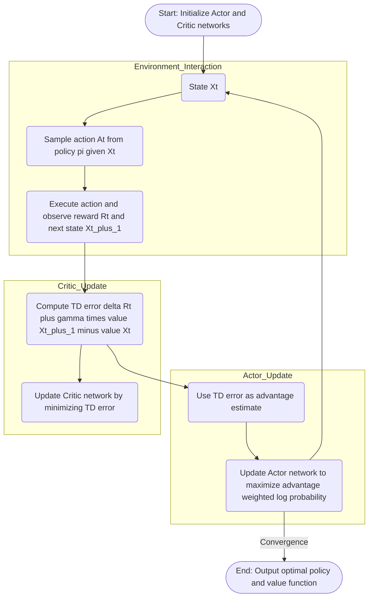

---
tags:
  - concept
  - machine_learning/algorithms
  - reinforcement_learning/algorithm
  - actor_critic_algorithm
  - advantage_actor_critic_algorithm
  - A2C_algorithm
keywords:
  - advantage_actor_critic_algorithm
  - actor_critic_algorithm
  - reinforce_algorithm_baseline
  - a2c
topics:
  - reinforcement_learning/algorithm
name: Advantage and Advantage Actor Critic or A2C Algorithm
date of note: 2024-05-12
---

## Concept Definition

>[!important]
>**Name**: Advantage Actor Critic or A2C and A3C Algorithm

### Advantage Function

>[!important] Definition
>The **advantage function** is defined as 
>$$
>A(x_{t}, a_{t}) = Q(x_{t}, a_{t}) - V(x_{t})
>$$
>where 
>- $(x_{t}, a_{t})$ are state and action at $t$ 
>- $Q(\cdot, \cdot)$ and $V(\cdot)$ are action-state and value-state functions.

^c94fbd

- [[Value Function and Bellman Equation for MDP]]

### Approximation of Advantage Function via TD Error

>[!important] 
>Assume that the value-state function is given by the value network $$V_{\theta}(x_{t})$$
>
>Then the **sample approximation of advantage function** is given by the *TD error* $$\hat{A}(x_{t}, a_{t}) := \delta_{t} := r_{t} + \gamma\,V_{\theta}(x_{t+1}) - V_{\theta}(x_{t})$$

^69485c

### Generalized Advantage Estimation

![[Generalized Advantage Estimation or GAE in PPO#^0abee5]]

- [[Generalized Advantage Estimation or GAE in PPO]]
- [[Temporal Difference Learning]]

### Actor-Critic Algorithm

![[Actor-Critic Algorithm#^5ba730]]

- [[Actor-Critic Algorithm]]
- [[REINFORCE Algorithm with Baseline]]
- [[REINFORCE Algorithm for Monte Carlo Policy Gradient]]

### Advantage Actor-Critic or A2C Algorithm 

>[!important] Definition  
>The **Advantage Actor-Critic (A2C)** algorithm is an extension of the standard Actor-Critic method that replaces the TD error with the **advantage function**, which stabilizes learning and reduces variance in policy gradient estimates.
>
>- **Actor**: the role of an *actor* is to **update** the **policy distribution** using the **advantage estimate**:
>	- The **advantage** quantifies how much better (or worse) an action is compared to the average at a given state:
>	  $$\hat{A}_t = R_{t+1} + \gamma \hat{v}(X_{t+1}, w_t) - \hat{v}(X_t, w_t) = \delta_t$$
>	- The **policy gradient update** becomes:
>	  $$
>	  \begin{align}
>	  \theta_{t+1} &\leftarrow \theta_{t} + \alpha_{\theta} \; \hat{A}_t \; \nabla_{\theta} \log \pi(A_t\,|\,X_t, \theta) \\
>	  &= \theta_t + \alpha_\theta \; \delta_t \; \nabla_{\theta} \log \pi(A_t\,|\,X_t, \theta)
>	  \end{align}
>	  $$
>	- The **advantage** serves as a **weight**: actions leading to better-than-expected outcomes are reinforced, while worse ones are discouraged.
>	- The **actor** improves the policy $\pi(\cdot\,|\,x,\theta)$ by maximizing the expected advantage.
>
>- **Critic**: the *critic* estimates the **value function** $\hat{v}(x, w_t)$, used to compute the advantage:
>	- It is trained by minimizing the squared **TD error**:
>	  $$
>	  \delta_t = R_{t+1} + \gamma \hat{v}(X_{t+1}, w_t) - \hat{v}(X_t, w_t)
>	  $$
>	- The **critic update** follows the **semi-gradient TD method**:
>	  $$
>	  \begin{align}
>	  w_{t+1} &\leftarrow w_t + \alpha_w \; \delta_t \; \nabla_w \hat{v}(X_t, w_t)
>	  \end{align}
>	  $$
>	- The critic aims to **reduce value estimation error**, allowing better advantage estimates for the actor.

### Mermaid Diagram

## Explanation

### Advantage vs. TD Error

| Concept       | Formula                                         | Use               | Target                                           |
| ------------- | ----------------------------------------------- | ----------------- | ------------------------------------------------ |
| **TD Error**  | $$\delta_t = r_t + \gamma V(s_{t+1}) - V(s_t)$$ | Update **critic** | Measures *prediction* error                      |
| **Advantage** | $$A(s_t, a_t) = Q(s_t, a_t) - V(s_t)$$          | Update **actor**  | Measures *action* "goodness" relative to average |

>[!info]
>In practice (especially in A2C), the **advantage** is often *estimated* using the **TD error** (especially in 1-step methods)

### Vanilla Actor Critic vs. A2C

| Feature                          | **Vanilla Actor-Critic**                                                                      | **Advantage Actor-Critic (A2C)**                                                                                  |
| -------------------------------- | --------------------------------------------------------------------------------------------- | ----------------------------------------------------------------------------------------------------------------- |
| **Policy Gradient Signal**       | Directly uses **TD error** $$\delta_t = r_t + \gamma V(s_{t+1}) - V(s_t)$$                    | Uses an **explicit estimate of the advantage** function $$\hat{A}_t$$, which may be *TD error* or *n-step return* |
| **Advantage Estimate**           | Not explicitly used                                                                           | Explicitly estimates and uses $$A(s_t, a_t) = Q(s_t, a_t) - V(s_t)$$ or approximations                            |
| **Variance Reduction**           | Higher variance                                                                               | Lower variance due to *better advantage estimation*                                                               |
| **Critic Role**                  | Estimates state value $$V(s_t)$$                                                              | Same as Actor-Critic — estimates $$V(s_t)$$                                                                       |
| **Actor Update Rule**            | $$\theta_{t+1} \leftarrow \theta_t + \alpha\, \delta_t\, \nabla_\theta \log \pi(a_t \| s_t)$$ | $$\theta_{t+1} \leftarrow \theta_t + \alpha \, \hat{A}_t \, \nabla_\theta \log \pi(a_t \| s_t)$$                  |
| **Typical Advantage Estimators** | Not defined — TD error is used directly                                                       | TD error, *n-step return*, or *GAE* (Generalized Advantage Estimation)                                            |
| **Training Stability**           | Less stable, more sensitive to noise                                                          | *More stable* and sample-efficient                                                                                |
| **Parallelism**                  | Often not parallelized                                                                        | A2C is typically implemented with **synchronous parallel environments** (distinguishing it from A3C)              |

- [[Actor-Critic Algorithm]]

>[!important]
> - **Vanilla Actor-Critic**: TD error is **used directly** as a crude advantage signal. 
> - **A2C**: The advantage $\hat{A}_t$ is **explicitly estimated**, improving **stability** and **performance**.

>[!important]
> **Key Difference** from vanilla Actor-Critic:
>- Instead of using just *TD error* as a signal, A2C *interprets* the TD error as the **advantage**.
>- A2C can be extended to *n-step returns* or *generalized advantage estimation (GAE)* to further reduce variance and improve learning stability.

- [[Multi-Step Return and Multi-Step Temporal Difference Learning]]
- [[Generalized Advantage Estimation or GAE in PPO]]
- [[Proximal Policy Optimization or PPO Algorithm]]

-----------
##  Recommended Notes and References

- [[Proximal Policy Optimization or PPO Algorithm]]
- [[Policy Gradient Algorithm]]
- [[Markov Decision Process]]

- [[Reinforcement Learning An Introduction by Sutton]]
- [[Probabilistic Machine Learning Advanced Topics by Murphy]] pp 1149
- Medium [blog](https://towardsdatascience.com/understanding-actor-critic-methods-931b97b6df3f)
