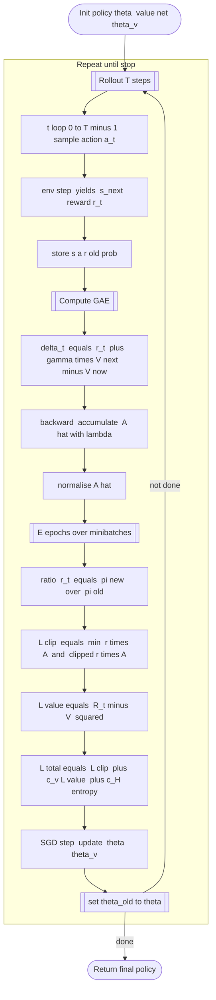

---
tags:
  - concept
  - machine_learning/algorithms
  - ppo
  - reinforcement_learning/algorithm
  - deep_learning/large_language_models
  - proximal_policy_optimization
keywords:
  - reinforcement_learning
  - proximal_policy_optimization
  - ppo
topics:
  - reinforcement_learning/algorithm
  - deep_learning/large_language_models
name: Proximal Policy Gradient or PPO Algorithm
date of note: 2024-05-12
---

## Concept Definition

>[!important]
>**Name**: Proximal Policy Optimization or PPO Algorithm

>[!important] Definition
>The **Proximal Policy Optimization** or **PPO** algorithm (*clipped objective*, *single–thread* version) is described as below:
>- *Require*:
>	- *Initial policy* $\pi_{\theta}$, 
>	- *value network* $V_{\theta_v}$ (parameters may be shared);  
>	- *rollout length* $T$; 
>	- minibatch size $M$; 
>	- epochs per update $E$;  
>	- *clip range* $\varepsilon$; 
>	- learning rate $\alpha$; 
>	- discount $\gamma$; 
>	- *GAE parameter* $\lambda$.
>- For iteration $k = 1,2,\dots$
>	- **Collect rollout**
>		- For $t = 0 \,{,}\ldots{,}\, T-1$:
>			- **Sample action** $$a_t \sim \pi_{\theta}( \cdot \mid s_t)$$ 
>			- Advance the environment one time-step with chosen action; (`env.step` or *step env* ) 
>				- Receive $(s_{t+1}, r_{t})$
>			- Store $$(s_t, a_t, r_t, s_{t+1}, \pi_{\theta}(a_t\!\mid\!s_t))$$
>	- **Compute advantages and returns (GAE)**
>		- $\hat A_T \gets 0,\; R_T \gets V_{\theta_v}(s_T)$
>		- For $t = T-1 \,{,}\ldots{,}\, 0$ (**backward recursion**)
>			- Compute **TD error** $$\delta_t \gets r_t + \gamma V_{\theta_v}(s_{t+1}) - V_{\theta_v}(s_t)$$
>			- *Exponentially weighted* aggregate $$\hat A_t \gets \delta_t + \gamma\lambda \hat A_{t+1}$$
>			- Adjust value from *baseline* $$R_t \gets \hat A_t + V_{\theta_v}(s_t)$$
>		- **Advantage averaging (normalisation)**
>			- Compute the mean of advantage $$\displaystyle \bar A \gets \frac{1}{T}\sum_{t=0}^{T-1} \hat A_t$$
>			- Compute the standard deviation $$\displaystyle \sigma_A \gets \sqrt{\frac{1}{T}\sum_{t=0}^{T-1} (\hat A_t-\bar A)^2 + \epsilon}$$
>			- Standardization: for $t= 0 \,{,}\ldots{,}\, T-1$  $$\hat A_t \gets \dfrac{\hat A_t-\bar A}{\sigma_A}$$
>	- **Optimise policy $\&$ value for $E$ epochs**
>		- For $e = 1 \ \textbf{to}\ E$
>			- *Shuffle rollout* and *split* into minibatches of size $M$
>			- For all minibatch $\mathcal B$
>				- Compute **probability ratio** $$r_t(\theta) = \frac{\pi_{\theta}(a_t\mid s_t)}{\pi_{\theta_{\text{old}}}(a_t\mid s_t)},\quad (s_t,a_t)\in\mathcal B$$
>				- Compute **clipped policy loss** $$\mathcal{L}^{\text{CLIP}} = -\frac1{|\mathcal{B}|}\sum_{t\in\mathcal{B}}\min\Bigl(r_t(\theta)\hat A_t,\; \operatorname{clip}\bigl(r_t(\theta),1-\varepsilon,1+\varepsilon\bigr) \hat A_t\Bigr)$$
>				- Compute **value loss** $$\displaystyle \mathcal L^{\text{V}} = \frac{1}{|\mathcal B|}\sum_{t\in\mathcal B}\bigl(R_t - V_{\theta_v}(s_t)\bigr)^2$$
>				- Compute **entropy bonus** $$\displaystyle \mathcal L^{\text{ENT}} = -\frac{1}{|\mathcal B|}\sum_{t\in\mathcal B} \mathcal H\bigl(\pi_{\theta}(\cdot\mid s_t)\bigr)$$
>				- **Total loss** is given by $$\displaystyle \mathcal L =  \mathcal L^{\text{CLIP}}  + c_v\,\mathcal L^{\text{V}} + c_H\,\mathcal L^{\text{ENT}}$$
>				- Update parameters\; $$(\theta, \theta_v) \leftarrow  (\theta, \theta_v) - \alpha \nabla_{(\theta,\theta_v)}\mathcal L$$
>	- **Update reference policy** 
>		- $$\theta_{\text{old}} \gets \theta$$

- [[Generalized Advantage Estimation or GAE in PPO]]
- [[Advantage and Advantage Actor Critic or A2C Algorithm]]
- [[Actor-Critic Algorithm]]
- [[Soft Actor-Critic Algorithm]]
- [[Group Relative Policy Optimization or GRPO Algorithm]]

>[!info]
>- *Sharing* parameters ($\theta = \theta_v$) or using separate networks both fit this template.
>- $c_v$ and $c_H$ are *scalar coefficients* (value loss and entropy bonus, e.g.\ 0.5 and 0.01).

### Clipped Surrogate Objective

>[!important]  Definition
> For a trajectory $\tau$ and time-step $t$:
> - the **probability ratio** $$r_t(\theta) ~=~ \dfrac{\pi_\theta(a_t\mid s_t)}{\pi_{\theta_{\text{old}}}(a_t\mid s_t)}$$
> - the **clipped surrogate loss** $$\mathcal L^{\text{CLIP}}(\theta) ~=~ \mathbb E_t\Bigl[ \min\bigl( r_t(\theta)\,\hat A_t,\; \operatorname{clip}(r_t(\theta),1-\epsilon,1+\epsilon)\,\hat A_t \bigr) \Bigr]$$
>where 
> 
> - $\hat A_t =$​ *advantage estimate* (usually **GAE**).
>     
> - $\epsilon\in[0.1,0.3] =$ *clip parameter*.
>     
> - When $r_t$​ stays in $[1-\epsilon,1+\epsilon]$ the gradient is the same as *vanilla PG*; 
> 	- outside, the term is *clipped*, preventing large updates.

>[!important] Definition
>Then the **total loss** combines *policy*, *value*, and *entropy bonus*:
>$$
>\mathcal{L}(\theta) = − \mathcal{L}^{\text{CLIP}}(\theta) + c_{v}\, \mathbb{E}_{ t }\left[ \left(V_{\theta}(s_{t}) - R_{t}\right)^2 \right] ​- c_{H}\, \mathbb{E}_{ t }\left[  \mathcal{H}\left(\pi_{\theta}\left(\cdot\,|\,s_{t}\right)\right) \right] .
>$$ 	  

### Mermaid Diagram

## Explanation

>[!info]
>PPO is an **actor-critic algorithm**.
>- it update both value function and policy function 

- [[Actor-Critic Algorithm]]

>[!info]
>- **Vanilla policy gradients** can take steps that change the policy too much, destabilising learning.
>     
> - **Trust‑Region Policy Optimization** (TRPO) fixes this with a hard KL‐divergence constraint but needs second‑order methods.
>     
> - **PPO** keeps the “small‑step” idea but uses _only first‑order gradients_ by **penalising or clipping** the policy update.

- [[Policy Gradient Algorithm]]
- [[Policy Gradient Theorem]]

>[!important]
>The **clipping (or KL‑penalty)** keeps the updated policy inside a _trust region_ without expensive second‑order optimisation, giving PPO a good balance of **simplicity, stability, and empirical performance** across Atari, MuJoCo, robotics, and many LLM fine‑tuning setups.

### Practical notes

> [!info]
>- **Multiple actors** (vectorised envs) improve sample throughput.
>     
> - **Shared vs. separate networks**: sharing base layers saves compute; separate heads can reduce interference.
>     
> - **Adaptive KL penalty** variant: replace clipping with a penalty term and adjust coefficient to maintain target KL.
>     
> - **Observation/return normalisation** helps with stability.
>     
> - **Reward scaling** or clipping often necessary in continuous‑control tasks.

## Soft Actor-Critic

- [[Soft Actor-Critic Algorithm]]

### Proximal Policy Optimization (PPO) vs. Soft Actor–Critic (SAC)

>[!info]
>_PPO_ trades data efficiency for extreme robustness by cautiously nudging an on-policy actor, whereas _SAC_ spends more compute to reuse experience and actively maximizes entropy, making it the go-to algorithm when samples are costly and continuous exploration matters.

| Aspect                               | **PPO**                                                                                                                                                                     | **Soft Actor–Critic (SAC)**                                                                                                                                                                                 |
| ------------------------------------ | --------------------------------------------------------------------------------------------------------------------------------------------------------------------------- | ----------------------------------------------------------------------------------------------------------------------------------------------------------------------------------------------------------- |
| **Paradigm**                         | _On-policy_ policy-gradient (actor–critic).                                                                                                                                 | _Off-policy_ maximum-entropy actor–critic.                                                                                                                                                                  |
| **Key Objective**                    | Clipped surrogate loss keeps the new policy close to the old one (trust-region–style).                                                                                      | Maximize expected return **plus an α · entropy bonus**; explicit temperature parameter α.                                                                                                                   |
| **Exploration Mechanism**            | Implicit: stochastic policy and clipped updates prevent premature collapse, but entropy is only an _optional_ bonus.                                                        | Explicit: entropy is part of the objective, so the policy is encouraged to stay stochastic until it is worth becoming confident.                                                                            |
| **Sample Efficiency**                | Moderate: trajectories are reused for a few epochs (<10) then discarded (on-policy).                                                                                        | High: replay buffer lets each transition be reused many times (off-policy).                                                                                                                                 |
| **Stability / Tuning**               | Very stable; few sensitive hyper-params (clip ε, GAE λ). Works well out of the box.                                                                                         | Stable **if** twin Q-function critics and automatic α tuning are used, but more moving parts (2 critics, target nets, α scheduler).                                                                         |
| **Continuous Control**               | Good, but needs careful scaling of action log-std.                                                                                                                          | Excellent; designed for continuous action spaces and broader entropy exploration.                                                                                                                           |
| **Discrete Action Support**          | Works natively.                                                                                                                                                             | Possible but less common — needs categorical policy and entropy term.                                                                                                                                       |
| **Computation per Environment Step** | Higher rollout cost (must interact fresh with env) but cheap updates.                                                                                                       | Cheaper environment interaction (can reuse buffer) but two critics and target nets make updates heavier.                                                                                                    |
| **When to Choose**                   | • Low-dim or **simulation** tasks where generating trajectories is cheap.   • You want quick, robust results with minimal tuning.   • Discrete or continuous actions. | • Real-world or hardware-in-the-loop where samples are **expensive**.   • Continuous robotics control, manipulation, locomotion.   • Need sustained exploration or robustness to multi-modal rewards. |
| **Canonical Implementations**        | OpenAI Baselines / RLlib PPO.                                                                                                                                               | DeepMind SAC / SoftLearning / Stable-Baselines3 SAC.                                                                                                                                                        |

## Other Variants

- [[Group Relative Policy Optimization or GRPO Algorithm]]

-----------
##  Recommended Notes and References

- [[Generalized Advantage Estimation or GAE in PPO]]
- [[Advantage and Advantage Actor Critic or A2C Algorithm]]
- [[Actor-Critic Algorithm]]
- [[Actor-Critic Algorithm with Eligibility Traces]]

- [[Reinforcement Learning An Introduction by Sutton]]

- [[Preference Alignment for LLM]]
- [[Supervised Fine-Tuning or Instruction Fine-Tuning of LLM]]
- [[Supervised Fine-Tuning and Preference Alignment for LLM]]

- Schulman, J., Wolski, F., Dhariwal, P., Radford, A., & Klimov, O. (2017). Proximal policy optimization algorithms. _arXiv preprint arXiv:1707.06347_.
- Schulman, J., Levine, S., Abbeel, P., Jordan, M., & Moritz, P. (2015, June). Trust region policy optimization. In _International conference on machine learning_ (pp. 1889-1897). PMLR.
