---
tags:
  - concept
  - machine_learning/algorithms
  - reinforcement_learning/algorithm
  - off_policy_temporal_difference_control
  - off_policy_learning
  - q_learning_algorithm
keywords:
  - q_learning
  - off_policy_learning
topics:
  - reinforcement_learning/algorithm
name: Q Learning Algorithm and Off-Policy Temporal Difference Control
date of note: 2024-05-12
---

## Concept Definition

>[!important]
>**Name**: Q Learning Algorithm and Off-Policy Temporal Difference Control

>[!info]
>One of the early breakthroughs in reinforcement learning was the development of an off-policy TD control algorithm known as **Q-learning**.
>
>Instead of Bellman equation for $q$, we now consider the *Bellman optimality equation* for $q_{*}$

![[Bellman Optimality Equation for MDP#^469b99]]

![[Bellman Optimality Equation for MDP#^2ff71a]]

![[Temporal Difference Learning#^a52316]]

![[SARSA Algorithm and On-Policy Temporal Difference Control#^cf105f]]

### Q-Learning Update

>[!important] Definition
>As compared to **SARSA update** which is based on **Bellman equation** for **action-value function**, *$Q$-learning* is based on the **Bellman optimality equation** for **action-value function**. 
>
>The update rule for **Q-learning** is defined by
>$$
> \begin{align}
> Q(X_{t}, A_{t}) &\leftarrow Q(X_{t}, A_{t}) + \alpha_{t}\left[ R_{t+1} + \gamma \max_{a'\in \mathcal{A}(X_{t+1})}Q(X_{t+1}, a')  - Q(X_{t}, A_{t}) \right]. 
> \end{align}
>$$ 
>- The **TD error** is defined as 
>$$
>\delta_{t} := R_{t+1} + \gamma \max_{a'\in \mathcal{A}(X_{t+1})}Q(X_{t+1}, a')  - Q(X_{t}, A_{t})
>$$

^d64bd3

- [[SARSA Algorithm and On-Policy Temporal Difference Control]]

### Q-Learning Algorithm for Off-Policy Control

>[!important] Definition
>The general form of the **$Q$-learning algorithm** is given in the following.
>
>- *Require*: action space $\mathcal{A}(x)$
>- *Require*: step size $\alpha_{t} >0$ for $t=1\,{,}\ldots{,}\,$
>- *Require*: reward *discount factor* $\gamma >0$
>- *Require*: $\epsilon >0$ controls the exploration. 
>- *Initialize* **table for action-value function** $Q_{0}(x, a)$ for all $x\in \mathcal{X}$ and $a\in \mathcal{A}$. 
>	- Note that the **terminal state** $Q_{0}(x_{\text{terminal}}, a) = 0$ for all $a\in \mathcal{A}$
>- For **episode** $k=1,\,2\,{,}\ldots{,}\,$:
>	- Initialize state $X_{0}$
>	- For step $t=0,\,1\,{,}\ldots{,}\,T$:
>		- *Randomly generate* an action $A \sim \text{Uniform}(\mathcal{A}(X_{t}))$
>		- Choose **action** $A_{t}$ given $Q_{t}$ and **current state** $X_{t}$ according to the **$\epsilon$-greedy rule** $$A_{t} = \left\{ \begin{array}{cc} A & \text{ with probability }\epsilon\\ \arg\max_{a\in \mathcal{A}(X_{t})}\,Q_{t}(X_{t}, a) &\text{ with probability }1 - \epsilon \end{array} \right.$$
>		- Observe **reward** $R_{t+1}$ and **next state** $X_{t+1}$
>		- Find the **optimal next action** $a_{t+1}$ given $X_{t+1}$ according to a **deterministic greedy rule** $$a_{t+1} = \arg\max_{a\in \mathcal{A}(X_{t+1})}\,Q_{t}(X_{t+1}, a).$$
>		- **Q-Learning update** $$Q_{t+1}(X_{t}, A_{t}) = Q_{t}(X_{t}, A_{t}) + \alpha_{t}\left[ R_{t+1} + \gamma Q_{t}(X_{t+1}, a_{t+1})  - Q_{t}(X_{t}, A_{t}) \right] $$

- [[epsilon-Greedy Algorithm]]
- [[Prediction and Control Problems in Reinforcement Learning]]

### Mermaid Diagram

```mermaid
flowchart TD
  Start([Start]) 
  Start --> InitQ["Initialize Q₀(x,a) for all x∈𝒳, a∈𝒜(x)\nSet Q₀(x_terminal,a)=0"]
  InitQ --> EpisodeLoop{"Episode k = 1 … K"}
  
  subgraph Episode
    EpisodeLoop --> InitState["X₀ ← initial state"]
    InitState --> StepLoop{"Step t = 0 … T"}
    
    subgraph Step
      StepLoop --> SampleA["Sample A ~ Uniform(𝒜(Xₜ))"]
      SampleA --> EpsilonGreedy{"ε-greedy select Aₜ:\nwith prob ε pick Sampled A\nelse pick argmax_a Qₜ(Xₜ,a)"}
      EpsilonGreedy --> Observe["Observe Rₜ₊₁ and next state Xₜ₊₁"]
      Observe --> GreedyNext["Compute aₜ₊₁ = argmax_a Qₜ(Xₜ₊₁,a)"]
      GreedyNext --> UpdateQ["Qₜ₊₁(Xₜ,Aₜ) ← Qₜ(Xₜ,Aₜ) + αₜ [Rₜ₊₁ + γ Qₜ(Xₜ₊₁,aₜ₊₁) – Qₜ(Xₜ,Aₜ)]"]
      UpdateQ --> IncrementT["t ← t + 1"]
      IncrementT --> StepLoop
    end
    
    StepLoop --> EpisodeLoop
  end
  
  EpisodeLoop --> End([End])

```

## Explanation

>[!important]
>As indicated in **Bellman optimality equation**, the learned action-value function, $Q$, directly approximates $q_{*}$, the **optimal action-value function**, independent of the policy being followed.  
>
>- While *Sarsa* is a sample-based **policy iteration** algorithm, 
>- the *Q-learning* is a sample-based **value-iteration** algorithm. 

- [[Policy Iteration Algorithm]]
- [[Value Iteration Algorithm]]

>[!important] 
>Q-learning is an **off-policy control** since the *target policy* learned does *not depend on the policy* used to *generate new action* $A_{t+1}$. 
>
>In fact, $$\max_{a'\in \mathcal{A}(X_{t+1})}Q(X_{t+1}, a')$$ implies that the *target policy* is a **deterministic greedy policy** $$\pi'(x) = \arg\max_{a'}Q(X_{t+1}, a'),$$ whereas the *behavior policy* $\pi$ is **stochastic** like $\epsilon$-greedy. 

- [[On-Policy and Off-Policy Reinforcement Learning]]
- [[Prediction and Control Problems in Reinforcement Learning]]

-----------
##  Recommended Notes and References

- [[Expected SARSA Algorithm]]
- [[SARSA Algorithm and On-Policy Temporal Difference Control]]
- [[Temporal Difference Learning]]

- [[Bellman Optimality Equation for MDP]]
- [[Value Function and Bellman Equation for MDP]]
- [[Markov Decision Process]]

- [[Reinforcement Learning An Introduction by Sutton]] pp 131
- [[Distributional Reinforcement Learning by Bellemare]] pp 69, 201
- [[Probabilistic Machine Learning Advanced Topics by Murphy]] pp 1143
- [[Foundations of Machine Learning by Mohri]] pp 331
- [[An Introduction to Deep Reinforcement Learning by Francois-Lavet]]
- [[Artificial Intelligence Modern Approach by Russell]] pp 831
