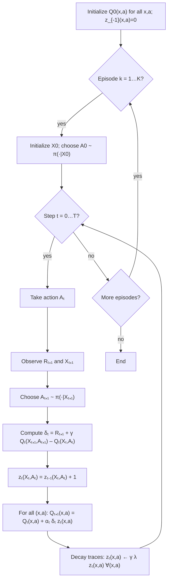

---
tags:
  - concept
  - reinforcement_learning/algorithm
  - reinforcement_learning/theory
keywords:
  - sarsa_lambda_algorithm
  - eligibility_traces
topics:
  - reinforcement_learning/algorithm
name: SARSA lambda Algorithm
date of note: 2024-08-09
---

## Concept Definition

>[!important]
>**Name**: SARSA($\lambda$) Algorithm

![[Temporal Difference lambda Algorithm#^cba720]]

- [[Temporal Difference lambda Algorithm]]

>[!important] Definition
>In *SARSA($\lambda$)*, define the **eligibility trace** as a real-valued function for each state-action pair. That is,
>$$
>(x, a) \to z(x, a) \in \mathbb{R}
>$$
>
>Given state $X_{t}$ at time $t$, assume that $A_{t}$ is chosen, the **update rule** for *eligibility trace*  is
>$$
>\begin{align*}
> z_{-1}(x, a) &= 0, \quad \forall (x,a) \in \mathcal{X}\times \mathcal{A} \\[5pt]
> z_{t}(x, a) &= \left\{\begin{array}{lc}\gamma\,\lambda\, z_{t-1}(x, a) + 1& \text{ if } (x,a) = (X_{t}, A_{t})\\ \gamma\,\lambda\,z_{t-1}(x,a) & \text{ otherwise} \end{array}\right. 
>\end{align*}
>$$

>[!important] Definition
>The **SARSA($\lambda$) update rule** for *state-value function* given **eligibility trace** $e(x, a)$ is defined as
>$$
> \begin{align}
> Q_{t+1}(X_{t}, A_{t}) &= Q_{t}(X_{t}, A_{t}) + \alpha_{t}\left(R_{t+1} + \gamma Q_{t}(X_{t+1}, A_{t+1})  - Q_{t}(X_{t}, A_{t})\right)\;z_{t}(X_{t}, A_{t}) \\[5pt]
>&=   Q_{t}(X_{t}, A_{t}) + \alpha_{t}\,\delta_{t}\,z_{t}(X_{t}, A_{t})
> \end{align} 
>$$
>where $\delta_{t}$ is the **TD error** $$\delta_{t} := R_{t+1} + \gamma V_{t}(X_{t+1})  - V_{t}(X_{t}).$$

###  SARSA($\lambda$) Algorithm for Tabular Value

>[!important] Definition
>The **tabular-based SARSA($\lambda$) algorithm** is described as below:
>- *Require*:  *policy* $\pi$,
>- *Require*: step size $\alpha_{t} >0$ for $t=1\,{,}\ldots{,}\,$
>- *Require*: reward *discount factor* $\gamma \in (0,1)$
>- *Require*: decay factor $\lambda\in [0,1]$
>- *Initialize* **table for action-value function** $Q_{0}(x, a)$ for all $x\in \mathcal{X}$ and $a\in \mathcal{A}$. 
>	- Note that the **terminal state** $Q_{0}(x_{\text{terminal}}, a) = 0$ for all $a\in \mathcal{A}$
>- For **episode** $k=1,\,2\,{,}\ldots{,}\,$:
>	- Initialize state $X_{0}$, and 
>	- Choose an *action* $A_{0}$ from $X_{0}$ based on policy derived from $Q_{0}$, $$A_{0} \sim \pi(\cdot\,|\,X_{0}\,)$$ 
>	- Initialize *eligibility trace* $z_{-1}(x, a) =0$ for all $x\in \mathcal{X}$ and $a\in \mathcal{A}$
>	- For step $t=0,\,1\,{,}\ldots{,}\,T$:
>		- Take Action $A_{t}$
>		- Observe **reward** $R_{t+1}$ and **next state** $X_{t+1}$
>		- Generate the **next action** $A_{t+1}$ from *next state* $X_{t+1}$  based on policy $\pi$ derived from $Q_{t}$ $$A_{t+1} \sim \pi(\cdot\,|\,X_{t+1}\,)$$
>		- Compute the **temporal difference error** $$\delta_{t} = R_{t+1} + \gamma Q_{t}(X_{t+1}, A_{t+1})  - Q_{t}(X_{t}, A_{t}) $$
>		- Update **eligibility trace** for *observed state-action pair* $$z_{t}(X_{t}, A_{t}) = z_{t-1}(X_{t}, A_{t}) + 1$$ 
>		- For *all state-action pair* $(x,a) \in \mathcal{X}\times \mathcal{A}$
>			- Update *action-value function* for **all state-action pair** (not just observed one) using **TD error** with **eligibility trace** $$Q_{t+1}(x, a) = Q_{t}(x, a) + \alpha\,\delta_{t}\,z_{t}(x, a)$$
>			- Adjust the *eligibility trace* for all action-values by a decay factor $$z_{t}(x, a) \leftarrow \gamma\,\lambda\,z_{t}(x, a)$$

- [[SARSA Algorithm and On-Policy Temporal Difference Control]]
- [[Temporal Difference lambda Algorithm]]

## Eligibility Trace for Semi-Gradient Algorithm

![[Temporal Difference lambda Algorithm#^b68ae0]]

>[!important] Definition
>In *semi-gradient SARSA($\lambda$)*, the **eligibility trace** vector is initialized with zero at the *beginning of the episode*; and it is incremented on each time by the *value gradient*, with *decay* $\gamma\,\lambda$ 
>$$
>\begin{align*}
> z_{-1} &= 0 \\[5pt]
> z_{t} &= \gamma\,\lambda\,z_{t-1} + \nabla \hat{q}(X_{t}, A_{t}; w_{t}), \quad 0 \le t\le T.
>\end{align*}
>$$
>where $\gamma >0$ is the *discount rate,* and $\lambda \in [0,1]$ is the parameter determine the *$\lambda$-return.* 
>
>This *eligibility trace* defined above is called the **accumulating trace**.

### Semi-Gradient SARSA($\lambda$) Algorithm

>[!important] Definition
>The **Semi-Gradient SARSA($\lambda$)** algorithm is described as the followings:
>- *Require*: the *policy* $\pi$ in evaluation
>- *Require*: approximate value function $\hat{q}(\cdot, \cdot; w): \mathcal{X} \times \mathcal{A} \to \mathbb{R}$ parameterized by $w\in \mathbb{R}^d$ and is *differentiable* in $w$. Set $\hat{v}(\text{terminal}; w) = 0$ for all $w$
>- *Require*: step size $\alpha >0$
>- *Require*: **trace decay rate** $\lambda\in [0,1]$
>- *Initialize* $w_{0}\in \mathbb{R}^d$
>- For *episode* $k=1 \,{,}\ldots{,}\,$
>	- Initialize state $X_{0}$
>	- Choose *action* $A_{0} \sim \pi(\cdot\,|\,X_{0})$ according to policy from $\hat{q}_{0}$
>	- Initialize $z_{-1} = 0$
>	- For $t=0\,{,}\ldots{,}\,T-1$
>		- Take action $A_{t}$
>		- Observe *reward* $R_{t+1}$ and *next state* $X_{t+1}$
>		- Choose *action* $A_{t+1}$ from $X_{t+1}$ according to policy $\pi$ from $\hat{q}_{t}$, $$A_{t+1} \sim \pi(\cdot\,|\,X_{t+1})$$
>		- Compute the **eligibility trace vector** $$z_{t} = \gamma\,\lambda\,z_{t-1} + \nabla \hat{q}(X_{t}, A_{t}; w_{t})$$
>		- Compute the **temporal difference error** $$\delta_{t} = R_{t+1} + \gamma \,\hat{q}(X_{t+1}, A_{t+1} ; w_{t}) - \hat{q}(X_{t}, A_{t}; w_{t})$$
>		- Update **parameter** for value function using **semi-gradient update** with *eligibility trace* $$\begin{align*}w_{t+1} &=w_{t} + \alpha\,\delta_{t}\,z_{t} \end{align*}$$

- [[Temporal Difference lambda Algorithm]]

## Explanation

>[!info]
>Compare with *tabular representation*, the *eligibility trace* with *function approximation* **do not** need to update value function for each state **independently**. 

-----------
##  Recommended Notes and References

- [[Temporal Difference lambda Algorithm]]
- [[Eligibility Traces]]

- [[Multi-Step SARSA Algorithm Off-Policy]]
- [[Multi-Step Return and Multi-Step Temporal Difference Learning]]

- [[SARSA Algorithm and On-Policy Temporal Difference Control]]
- [[Temporal Difference Learning]]

- [[Prediction and Control Problems in Reinforcement Learning]]
- [[Value Function and Bellman Equation for MDP]]
- [[Monte Carlo and Applications]]

- [[Reinforcement Learning An Introduction by Sutton]] pp 303 - 307