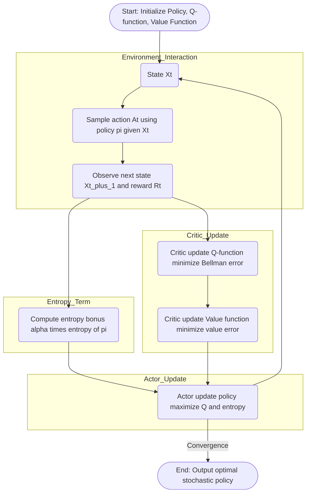

---
tags:
  - concept
  - reinforcement_learning/theory
  - reinforcement_learning/algorithm
  - soft_actor_critic_algorithm
  - maximum_entropy_reinforcement_learning
keywords:
  - soft_actor_critic_algorithm
topics:
  - reinforcement_learning
name: Soft Actor-Critic Algorithm
date of note: 2024-07-13
---

## Concept Definition

>[!important]
>**Name**: Soft Actor-Critic Algorithm

![[Maximum Entropy Reinforcement Learning#^4c30b8]]

### Algorithm

>[!important] Definition
>Consider the problem of *maximizing the soft value* for an *episodic task*:
>$$
>\max_{\pi}\;J(\pi) := \mathbb{E}^{\pi}\left[ \sum_{k=0}^{\infty}\gamma^{k}\left( R_{t+k+1} + \alpha \mathcal{H}(\pi(\cdot|X_{t+k})) \right) \,\Big|\, X_{t} = x \right]
>$$
>where
>- $\pi$ is a **stochastic policy** *parameterized* by $\theta$ $$\pi(a\,|\,x;\, \theta)$$
>- $\hat{q}(x,a; w_q)$ is the **Q-value function** *parameterized* by $w_q$.
>- $\hat{v}(x; w_v)$ is the **soft state-value function** *parameterized* by $w_v$.
>- $\mathcal{H}(\pi(\cdot|x))$ is the **entropy** of the policy at state $x$.
>- $\alpha>0$ is the **temperature** controlling the tradeoff between reward maximization and entropy maximization.
>  
>The **Soft Actor-Critic algorithm** maximizes the expected soft returns as follows:
>
>- *Require*: a *differentiable parameterized policy* $\pi(a\,|\,x;\, \theta)$
>- *Require*: a *differentiable parameterized Q-function* $\hat{q}(x,a; w_q)$
>- *Require*: a *differentiable parameterized soft value function* $\hat{v}(x; w_v)$
>- *Require*: reward discount factor $\gamma\in (0,1)$
>- *Require*: temperature parameter $\alpha$
>- *Require*: step sizes $\alpha_{\theta}$, $\alpha_{w_q}$, and $\alpha_{w_v}$
>- Initialize $\theta^{(0)}$, $w_q^{(0)}$, and $w_v^{(0)}$
>
>- For **episode** $k=1, \ldots,$
>	- Sample an Initial State $X_{0}$
>	- For $t=1, 2, \ldots$ until $X_{t}$ is a **terminal state**:
>		- *Sample* **action** according to the **current policy**:
>		  $$
>		  A_{t} \sim \pi(\cdot|X_{t-1};\theta^{(t-1)})
>		  $$
>		- Take the action.
>		- *Receive* **reward** and *observe* **next state**:
>		  $$
>		  R_{t}, \quad X_{t}
>		  $$
>		- **Critic (Q-function update)**: Update $w_q$ by minimizing the **soft Bellman error**:
>			- **Soft Bellman Error** $$\mathcal{L}_{Q} = \left( \hat{q}(X_{t-1}, A_t; w_q^{(t-1)}) - \left( R_{t} + \gamma \hat{v}(X_{t}; w_v^{(t-1)}) \right) \right)^2$$
>			- Update:  $$w_q^{(t)} = w_q^{(t-1)} - \alpha_{w_q} \nabla_{w_q} \mathcal{L}_{Q}$$
>		- **Critic (Value function update)**: Update $w_v$ by minimizing the **soft value error**:
>			- **Soft Value Error**  $$\mathcal{L}_{V} = \left( \hat{v}(X_{t-1}; w_v^{(t-1)}) - \mathbb{E}_{A' \sim \pi}\left[ \hat{q}(X_{t-1}, A'; w_q^{(t)}) - \alpha \log \pi(A'|X_{t-1}; \theta^{(t-1)}) \right] \right)^2$$
>			- Update: $$w_v^{(t)} = w_v^{(t-1)} - \alpha_{w_v} \nabla_{w_v} \mathcal{L}_{V}$$
>		- **Actor (Policy update)**: Update $\theta$ by minimizing the **expected divergence** from optimal Q-values:
>			  - **Expected Divergence** $$\mathcal{L}_{\pi} = \mathbb{E}_{A \sim \pi}\left[ \alpha \log \pi(A|X_{t-1}; \theta^{(t-1)}) - \hat{q}(X_{t-1}, A; w_q^{(t)}) \right]$$
>			- Update: $$\theta^{(t)} = \theta^{(t-1)} - \alpha_{\theta} \nabla_{\theta} \mathcal{L}_{\pi}$$
>
>- *Return*:
>	- **Actor** returns the **optimal maximum-entropy policy** $$\pi(a\,|\,x;\,\theta^*)$$
>	- **Critic** returns the **optimal soft value estimates** $$\hat{q}(x,a; w_q^*) \quad \text{and} \quad \hat{v}(x; w_v^*)$$

- [[Maximum Entropy Reinforcement Learning]]
- [[Policy Gradient Algorithm]]
- [[Entropy Minimization Algorithm]]
- [[Kullback-Leibler Divergence]]

### Mermaid Diagram

## Explanation

### Compare with Actor Critic

| Aspect          | Standard Actor-Critic                          | Soft Actor-Critic (SAC)                            |
| --------------- | ---------------------------------------------- | -------------------------------------------------- |
| **Objective**   | Maximize expected cumulative reward            | Maximize expected reward **plus entropy**          |
| **Critic**      | State-value function                           | **Soft Q-value** and soft value functions          |
| **Exploration** | Implicit                                       | *Explicitly encouraged* via entropy regularization |
| **Policy Type** | Stochastic (but can converge to deterministic) | Explicitly *stochastic*                            |

- [[Actor-Critic Algorithm]]

-----------
##  Recommended Notes and References

- [[Reinforcement Learning]]
- [[Maximum Entropy Learning]]
- [[Kullback-Leibler Divergence]]
- [[Markov Decision Process]]

- [[Reinforcement Learning An Introduction by Sutton]]
- [[Markov Decision Processes by Puterman]]
- [[Probabilistic Machine Learning Advanced Topics by Murphy]] pp 1171

- Medium [Maximum Entropy Policies in Reinforcement Learning & Everyday Life](https://awjuliani.medium.com/maximum-entropy-policies-in-reinforcement-learning-everyday-life-f5a1cc18d32d)
- Youtube [CS885 Module 2: Maximum Entropy Reinforcement Learning](https://www.youtube.com/watch?v=ZsW0LCPPWHU)
- Haarnoja, T., Zhou, A., Abbeel, P., & Levine, S. (2018, July). Soft actor-critic: Off-policy maximum entropy deep reinforcement learning with a stochastic actor. In _International conference on machine learning_ (pp. 1861-1870). PMLR.
- Haarnoja, T., Zhou, A., Hartikainen, K., Tucker, G., Ha, S., Tan, J., ... & Levine, S. (2018). Soft actor-critic algorithms and applications. _arXiv preprint arXiv:1812.05905_.