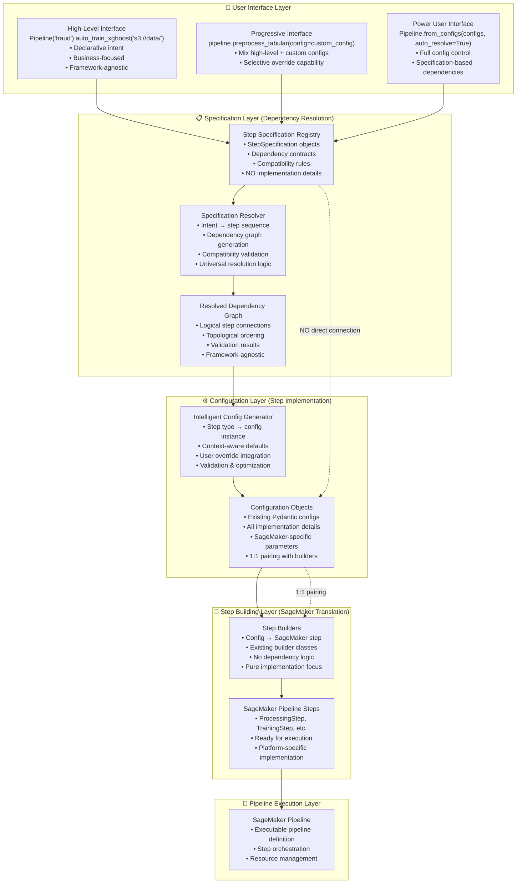
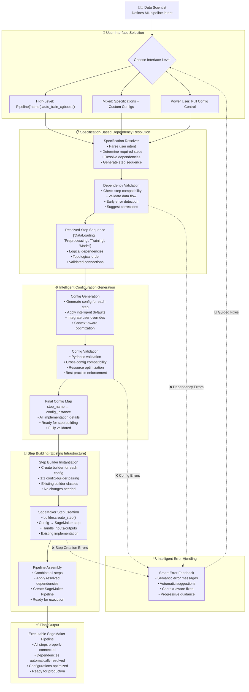

---
tags:
  - entry_point
  - design/design_architecture
  - design/design_philosophy
  - aws/sagemaker_pipeline
aliases: 
date of note: 2025-07-04
---
# **Hybrid Specification + Config Architecture: The Best of Both Worlds**

## **Layered Architecture**



## **User Input to Implementation Flow**



## **User Experience & Development Flow**

### **Level 1: High-Level Declarative (Beginners)**
```python
# Day 1: Working pipeline
pipeline = Pipeline("fraud_detection").auto_train_xgboost("s3://fraud-data/")

# Behind the scenes:
# 1. Specifications resolve: data_loading → preprocessing → training → model
# 2. Intelligent defaults generate appropriate configs
# 3. Existing builders create SageMaker steps
# 4. Dependencies automatically resolved
```

### **Level 2: Progressive Enhancement (Intermediate)**
```python
# Week 1: Add custom configurations where needed
pipeline = (Pipeline("fraud_detection")
    .load_data("s3://fraud-data/")
    .preprocess_tabular(
        config=TabularPreprocessingConfig(
            instance_type="ml.m5.4xlarge",
            custom_transformations=["log_transform"]
        )
    )
    .train_xgboost(max_depth=8, n_estimators=200)
    .evaluate_performance())

# Specifications handle dependencies, configs handle implementation
```

### **Level 3: Full Control (Power Users)**
```python
# Full config control with automatic dependency resolution
configs = [
    CradleDataLoadConfig(s3_bucket="fraud-data", job_type="training"),
    TabularPreprocessingConfig(job_type="training", instance_type="ml.m5.4xlarge"),
    XGBoostTrainingConfig(max_depth=8, n_estimators=200)
]

# Specifications still resolve dependencies automatically
pipeline = Pipeline.from_configs(configs, auto_resolve_dependencies=True)
```

## **Dependency Resolution Mechanisms**

### **Hybrid Approach: Specifications + Existing Infrastructure**

#### **Specification-Based Resolution (New)**
```python
# Step specifications define compatibility
XGBOOST_TRAINING_SPEC = StepSpecification(
    step_type="XGBoostTraining",
    dependencies=[
        DependencySpec(
            logical_name="training_data",
            compatible_sources=["TabularPreprocessing"],
            data_types=["processed_tabular"],
            semantic_keywords=["training", "processed"]
        )
    ]
)

# Universal resolver works for all pipeline types
class SpecificationResolver:
    def resolve_dependencies(self, step_types: List[str]) -> PipelineDAG:
        nodes = step_types
        edges = []
        
        for step_type in step_types:
            spec = self.registry.get_specification(step_type)
            for dependency in spec.dependencies:
                compatible_sources = self._find_compatible_sources(dependency, step_types)
                for source in compatible_sources:
                    edges.append((source, step_type))
        
        return PipelineDAG(nodes=nodes, edges=edges)
```

#### **Config-Based Implementation (Existing)**
```python
# Existing step builders handle SageMaker implementation
# NO changes needed to existing builders
class XGBoostTrainingStepBuilder(StepBuilderBase):
    def create_step(self, **kwargs) -> TrainingStep:
        # Same implementation as before
        return TrainingStep(
            name=self.config.step_name,
            estimator=self._create_estimator(),
            inputs=kwargs.get('inputs', {}),
        )
```

## **Step Building Mechanism**

### **Preserved Existing Architecture**
```python
# 1. Config generation (new intelligent layer)
config = XGBoostTrainingConfig(
    max_depth=8,  # from user or intelligent default
    n_estimators=200,
    instance_type="ml.m5.2xlarge"
)

# 2. Step builder creation (existing, unchanged)
builder = XGBoostTrainingStepBuilder(config=config)

# 3. SageMaker step creation (existing, unchanged)
step = builder.create_step(
    inputs=resolved_inputs,  # from specification resolver
    outputs=generated_outputs
)
```

### **Enhanced Input Resolution**
```python
# Specification resolver provides clean inputs
resolved_inputs = {
    "training_data": "s3://bucket/preprocessing/output/",
    "model_artifacts": "s3://bucket/training/model/"
}

# No more complex property path resolution needed
# No more manual message propagation
# Clean, semantic input names
```

## **Error Handling & Debugging**

### **Early Detection Through Specifications**
```python
# Specification validation catches issues at design time
try:
    pipeline = Pipeline("fraud").auto_train_xgboost("s3://data/")
except IncompatibleStepsError as e:
    print(f"Step compatibility issue: {e.message}")
    print(f"Suggestion: {e.suggested_fix}")
    # "XGBoost training requires processed tabular data. Add preprocessing step?"

except MissingDependencyError as e:
    print(f"Missing dependency: {e.message}")
    print(f"Available options: {e.compatible_sources}")
    # "Training step needs data source. Compatible: [DataLoading, Preprocessing]"
```

### **Semantic Error Messages**
```python
# Instead of: "Source step training has no output model_artifacts (tried all paths)"
# Now: "XGBoost training step expects processed tabular data, but DataLoading step produces raw data. Add TabularPreprocessing step between them?"

# Instead of: "Multiple configs found for TabularPreprocessingConfig with {'job_type': 'training'}"
# Now: "Multiple preprocessing configurations found for training data. Please specify which one to use or merge them."
```

### **Automatic Suggestions**
```python
class PipelineValidator:
    def validate_and_suggest(self, pipeline_intent):
        issues = self._find_compatibility_issues(pipeline_intent)
        for issue in issues:
            suggestion = self._generate_suggestion(issue)
            return ValidationResult(
                is_valid=False,
                error_message=issue.semantic_description,
                suggested_fix=suggestion.implementation_code,
                alternative_approaches=suggestion.alternatives
            )
```

## **Scalability & Maintenance**

### **Universal Resolver (vs. Template Proliferation)**
```python
# ONE resolver works for ALL pipeline types
class UniversalSpecificationResolver:
    def resolve_any_pipeline(self, step_types: List[str]) -> PipelineDAG:
        # Same logic works for:
        # - XGBoost end-to-end
        # - PyTorch end-to-end  
        # - Data preprocessing only
        # - Model evaluation only
        # - Any combination of steps
        
        return self._resolve_dependencies_from_specifications(step_types)

# NO MORE template_pipeline_*.py files needed
# NO MORE manual DAG definitions
# NO MORE duplicate dependency logic
```

### **Easy Extension**
```python
# Adding new step type requires only:
# 1. New step specification (dependency metadata)
NEW_STEP_SPEC = StepSpecification(
    step_type="DeepLearningTraining",
    dependencies=[...],
    outputs=[...]
)

# 2. New config class (existing pattern)
class DeepLearningTrainingConfig(BasePipelineConfig):
    # Implementation details only
    pass

# 3. New step builder (existing pattern)
class DeepLearningTrainingStepBuilder(StepBuilderBase):
    # SageMaker implementation only
    pass

# Automatic integration with ALL existing pipelines
# NO changes to resolver or other components
```

## **Development Velocity**

### **Hybrid Development Timeline**

#### **High-Level Interface (Day 1)**
```python
# Working prototype in minutes
pipeline = Pipeline("fraud_detection").auto_train_xgboost("s3://data/")
pipeline.execute()  # Ready to run
```

#### **Progressive Enhancement (Week 1)**
```python
# Add custom configurations as needed
pipeline = (Pipeline("fraud_detection")
    .load_data("s3://data/")
    .preprocess_tabular(instance_type="ml.m5.4xlarge")
    .train_xgboost(max_depth=8, n_estimators=200)
    .evaluate_performance(metrics=["auc", "precision", "recall"]))
```

#### **Production Ready (Week 2)**
```python
# Full production pipeline with monitoring, quality gates, etc.
pipeline = (Pipeline("fraud_detection")
    .load_data("s3://data/", validation_split=0.2)
    .preprocess_with_quality_checks()
    .train_xgboost_with_hyperparameter_tuning()
    .evaluate_with_business_metrics()
    .deploy_with_monitoring())
```

## **Knowledge Requirements**

### **Tiered Knowledge Model**

#### **Level 1: Business Users**
- **Domain Knowledge**: Understanding of ML pipeline concepts
- **High-Level Configuration**: Basic parameter tuning
- **No Infrastructure Knowledge**: Specifications handle complexity

#### **Level 2: ML Engineers**
- **Config Customization**: Ability to create custom configurations
- **Performance Tuning**: Understanding of resource optimization
- **Some SageMaker Knowledge**: For advanced configurations

#### **Level 3: Platform Engineers**
- **Full System Knowledge**: Understanding of specifications, configs, and builders
- **Extension Development**: Ability to add new step types
- **Deep SageMaker Expertise**: For complex integrations

## **Key Benefits: Best of Both Worlds**

### **Comparison Matrix**

| Aspect | Config-Driven (Current) | Pure Specification-Driven | **Hybrid (Proposed)** |
|--------|------------------------|---------------------------|----------------------|
| **Dependency Resolution** | ❌ Manual DAG definition<br/>❌ Complex property paths<br/>❌ Template proliferation | ✅ Automatic resolution<br/>✅ Semantic matching<br/>✅ Universal logic | ✅ **Specification-based resolution**<br/>✅ **Universal resolver**<br/>✅ **Early validation** |
| **Step Implementation** | ✅ Detailed configuration<br/>✅ Pydantic validation<br/>✅ Production-ready | ❌ May lack implementation detail<br/>❌ New infrastructure needed | ✅ **Existing config classes**<br/>✅ **Existing step builders**<br/>✅ **No breaking changes** |
| **User Experience** | ❌ Expert knowledge required<br/>❌ Manual coordination<br/>❌ Late error detection | ✅ High-level interface<br/>✅ Automatic assembly<br/>✅ Early validation | ✅ **Tiered interfaces**<br/>✅ **Progressive enhancement**<br/>✅ **Flexible control levels** |
| **Development Velocity** | ❌ Weeks to working pipeline<br/>❌ Complex debugging | ✅ Minutes to prototype<br/>✅ Semantic errors | ✅ **Minutes to prototype**<br/>✅ **Weeks to production**<br/>✅ **Intelligent debugging** |
| **Scalability** | ❌ Template per pipeline type<br/>❌ Duplicate logic | ✅ Universal patterns<br/>✅ Easy extension | ✅ **Universal resolver**<br/>✅ **Reuse existing infrastructure**<br/>✅ **Easy extension** |
| **Investment Protection** | ✅ Existing infrastructure<br/>✅ Proven in production | ❌ Complete rewrite needed<br/>❌ Migration complexity | ✅ **Zero breaking changes**<br/>✅ **Gradual migration**<br/>✅ **Preserve all investments** |

### **Hybrid Advantages**

#### **1. Evolutionary, Not Revolutionary**
- **Preserve Investments**: All existing configs, builders, and pipelines continue to work
- **Gradual Adoption**: Teams can migrate at their own pace
- **Risk Mitigation**: No big-bang changes, incremental improvements

#### **2. Best User Experience at Every Level**
- **Beginners**: High-level declarative interface with intelligent defaults
- **Intermediate**: Mix specifications with custom configurations
- **Experts**: Full control with automatic dependency resolution

#### **3. Optimal Complexity Distribution**
- **Specifications**: Handle the complex, error-prone dependency resolution
- **Configs**: Handle the detailed, step-specific implementation
- **Builders**: Continue to handle SageMaker integration (no changes)

#### **4. Universal Scalability**
- **One Resolver**: Works for all current and future pipeline types
- **Easy Extension**: New step types integrate automatically
- **Reduced Maintenance**: Eliminate template proliferation and duplicate logic

#### **5. Production-Ready from Day One**
- **Proven Infrastructure**: Builds on existing, battle-tested components
- **Enhanced Capabilities**: Adds intelligent automation without breaking existing functionality
- **Immediate Benefits**: Better user experience and faster development without migration costs

This hybrid architecture delivers **specification-driven simplicity for users** while **preserving config-driven robustness for implementation**, creating the optimal balance between ease of use and production readiness.


-----------
##  Recommended Notes

- [[Config-Driven vs Specification-Driven Design]]
- [[Config-Driven vs Specification-Driven Design Key Differences]]
- [[Config-Driven vs Specification-Driven Design User Perspective]]

- [[Comparison of Design Philosophy Developer Perspective]]
- [[Comparison of Design Philosophy User Perspective]]