---
tags:
  - entry_point
  - thought
  - design/design_architecture
  - aws/sagemaker_pipeline
aliases: 
date of note: 2025-07-03
---

## Layered Abstraction (Specification-Driven Design)

Components are organized in clear layers with defined responsibilities:

## User Input to Implementation Flow

```mermaid
flowchart TD
    %% User Input Layer
    UserInput1["🧑‍💻 User Input:<br/>pipeline.auto_train_xgboost()"]
    UserInput2["🧑‍💻 User Input:<br/>Fluent API Chaining"]
    UserInput3["🧑‍💻 User Input:<br/>Specification Config"]
    
    %% Processing Flow
    UserInput1 --> FluentAPI
    UserInput2 --> FluentAPI
    UserInput3 --> PipelineBuilder
    
    subgraph "🎯 Fluent API Layer"
        FluentAPI["Method Chaining<br/>Context Building<br/>Progressive Disclosure"]
    end
    
    FluentAPI --> PipelineBuilder
    
    subgraph "🏗️ Orchestration Layer"
        PipelineBuilder["Pipeline Template Builder V2<br/>• Parse user intent<br/>• Coordinate components<br/>• Validate specifications"]
    end
    
    PipelineBuilder --> SmartProxy
    
    subgraph "🧠 Intelligent Abstraction Layer"
        SmartProxy["Smart Proxy<br/>• Auto-resolve dependencies<br/>• Type-safe construction<br/>• Dynamic configuration"]
    end
    
    SmartProxy --> StepBuilder
    
    subgraph "🔧 Implementation Bridge Layer"
        StepBuilder["Step Builder<br/>• Translate specs to SageMaker<br/>• Handle I/O transformation<br/>• Apply configurations"]
    end
    
    StepBuilder --> Config
    StepBuilder --> StepSpec
    
    subgraph "⚙️ Configuration Layer"
        Config["Configuration Management<br/>• Environment overrides<br/>• Template resolution<br/>• Validation rules"]
    end
    
    subgraph "📋 Specification Layer"
        StepSpec["Step Specifications<br/>• Define interfaces<br/>• Quality requirements<br/>• Validation rules"]
    end
    
    Config --> DependencyResolver
    StepSpec --> DependencyResolver
    
    subgraph "🔗 Dependency Resolution Layer"
        DependencyResolver["Dependency Resolver<br/>• Multi-criteria scoring<br/>• Semantic matching<br/>• Type safety validation"]
    end
    
    DependencyResolver --> RegistryLayer
    
    subgraph "📚 Registry Layer"
        RegistryManager["Registry Manager"]
        SpecReg1["Context A Registry"]
        SpecReg2["Context B Registry"]
        
        RegistryManager --> SpecReg1
        RegistryManager --> SpecReg2
    end
    
    RegistryLayer --> Foundation
    
    subgraph "🏛️ Foundation Layer"
        Foundation["Pipeline DAG + Base Specs + Semantic Matcher<br/>• Topology validation<br/>• Core data models<br/>• Similarity scoring"]
    end
    
    Foundation --> SageMakerPipeline
    
    %% Final Output
    SageMakerPipeline["🚀 SageMaker Pipeline<br/>• Executable steps<br/>• Resolved dependencies<br/>• Validated configuration"]
    
    %% Error/Feedback Flow
    DependencyResolver -.->|"❌ Resolution Errors"| UserFeedback
    Config -.->|"❌ Config Errors"| UserFeedback
    StepSpec -.->|"❌ Validation Errors"| UserFeedback
    UserFeedback["📋 User Feedback<br/>• Error reports<br/>• Resolution suggestions<br/>• Debug information"]

```

## Implementation Layer

### Step Builder and Config

- [[Step Builder Design]]
- [[Base Step Builder]]
- [[Base Config]]
	- [[Base Config for Processing Step]]

### Step Specification

- [[Step Specification Design as Declarative Pipeline Architecture]]

## Intermediate Abstraction Layer

### Smart Proxy 

- [[Smart Proxy Design between Specification and Construction]]

### Fluent API

- [[Fluent API Design for Step Chaining]]

## Declarative Specification Layer

### Pipeline DAG

- [[Pipeline DAG Design]]
- [[Pipeline DAG Validation]]

### Dependency Resolution

- [[Specification Registry Design]]
- [[Registry Manager Design]]
- [[Dependency Resolver Design]]
- [[Semantic Matcher for Dependency Resolution]]

### Pipeline Specification

- [[Pipeline Specification]]

### Pipeline Template Builder

- [[Pipeline Template Builder v1]]
- [[Pipeline Template Builder v2]]

-----------
##  Recommended Notes

- [[Config-Driven vs Specification-Driven Design]]
- [[Config-Driven vs Specification-Driven Design User Perspective]]

- [[Config-Driven Design Architecture for Pipeline Automation]]
- [[Hybrid Design Architecture with Specification and Config]]

- [[Comparison of Design Philosophy Developer Perspective]]
- [[Comparison of Design Philosophy User Perspective]]