---
tags:
  - project
  - buyer_seller_messaging
  - multi-modal_learning
aliases: 
date of note: 2025-04-28
---

## Four Designs

### Concatenation

>[!important]
>**Direct concatenation** of two embeddings
>$$
>f_{\text{fuse}} = W_{\text{fuse}}\left[  W_{\text{text}}x_{\text{text}},  W_{\text{tab}}x_{\text{tab}}  \right]
>$$

- [[Multi-modal BERT Classification Model v2 for BSM]]
- [[Multi-modal BERT for FSDP Model Parallelism]]

| ID  | Network             |                  | Number of Parameters |
| --- | ------------------- | ---------------- | -------------------- |
| 0   | tab_subnetwork      | TabAE            | 1.2 K                |
| 1   | text_subnetwork     | TextBertBase     | 167 M                |
| 2   | final_merge_network | **Sequential**   | **603**              |
| 3   | loss_op             | CrossEntropyLoss | 0                    |

>[!info]
>- 167 M Trainable params
>- 0 Non-trainable params
>- 167 M Total params
>- **669.741** Total estimated model params size (MB)

```mermaid
flowchart TB
  %% Inputs
  A1["dialogue_processed_input_ids & attention_mask\nshape: B x C x T"]
  A2["tabular fields\nshape: B x input_tab_dim"]

  %% Text branch
  subgraph TextBranch["TextBertBase"]
    A1 --> B1["Reshape → (B·C) x T"]
    B1 --> B2["BERT encoder → pooler_output\nshape: (B·C) x H"]
    B2 --> B3["Reshape & mean over C → B x H"]
  end

  %% Tabular branch
  subgraph TabBranch["TabAE"]
    A2 --> C1["combine_tab_data → B x input_tab_dim"]
    C1 --> C2["LayerNorm → Linear(input_tab_dim→H) → ReLU\nshape: B x H"]
  end

  %% Fusion & classification
  B3 --> D1["Concat → B x (2H)"]
  C2 --> D1
  D1 --> D2["ReLU"]
  D2 --> D3["Linear(2H→num_classes)"]
  D3 --> E["logits\nshape: B x num_classes"]
```

### Fusion Gate

>[!important]
>- **Define the fusion gate** as the sigmoid gating mechanism with input as two embeddings
>$$
>g =  \sigma \left(  W_{g}\left[ W_{\text{text}}x_{\text{text}},  W_{\text{tab}}x_{\text{tab}}  \right]\right) 
>$$
>- Use the gate to define the *contribution of each modality* for each sample
>- Merge based on weighted sum $$f_{\text{fuse}} = g\, \odot W_{\text{text}}x_{\text{text}} + (1 - g)\, \odot W_{\text{tab}}x_{\text{tab}}$$

- [[Multi-modal BERT via Fusion Gate]]
- [[Gated Recurrent Units in Neural Network]]

### Mixture of Expert

>[!important]
>- Define the **router network** as a *classifier* to choose which expert $$p_{\text{router}} = [p_{0}, p_{1}] =  \text{softmax} \left(  W_{r}\left[ W_{\text{text}}x_{\text{text}},  W_{\text{tab}}x_{\text{tab}}  \right]\right)$$ 
>	- where $$p_{i} = P\left( \text{router choose }i\text{-th expert} \right)$$
>- Use the router network to choose which expert to use per sample
>- Merge based on weighted sum $$f_{\text{fuse}} = p_{0}\, W_{\text{text}}x_{\text{text}} + p_{1}\, W_{\text{tab}}x_{\text{tab}}$$

- [[Multi-modal BERT via Mixture of Experts]]
- [[Mixture of Experts or MoE as Deep Ensemble Learning]]
- [[Switch Transformer via Mixture of Expert Layer]]

| ID  | Network         |                      | Name of Parameters |
| --- | --------------- | -------------------- | ------------------ |
| 0   | tab_subnetwork  | TabAE                | 1.2 K              |
| 1   | text_subnetwork | TextBertBase         | 167 M              |
| 2   | moe_fusion      | **MixtureOfExperts** | **402**            |
| 3   | classifier      | **Sequential**       | **303**            |
| 4   | loss_op         | CrossEntropyLoss     | 0                  |

>[!info]
>- 167 M Trainable params
>- 0 Non-trainable params
>- 167 M Total params
>- **669.741** Total estimated model params size (MB)

### Cross Attention

>[!important]
>- Define the **cross attention layer** 
>	- **Text attend Tab**: output modified tabular embedding but *highlighted by* text query information
>		- *query: text*
>		- key: tab 
>		- value: tab
>	- **Tab attend Text**: output modified text embedding but *highlighted by* tabular query information
>		- *query: tab*
>		- key: text
>		- value: text
>- Let $h^t, h^a \in \mathbb{R}^H$ be the text and tabular embeddings, respectively
>- 
>$$
>\begin{aligned} 
>&X = \bigl[h^t\bigr] \in \mathbb{R}^{1\times H},  \qquad A = \bigl[h^a\bigr] \in \mathbb{R}^{1\times H}.\\[6pt]\end{aligned} 
>$$
>- Define Multi‐Head Attention:  $$\mathrm{MHA}(Q,K,V)\;:\;\mathbb{R}^{\ell_Q\times H}\times\mathbb{R}^{\ell_K\times H}\times\mathbb{R}^{\ell_V\times H} \to \mathbb{R}^{\ell_Q\times H}.$$
>- **Text attends to Tab** $$U^t \;=\;\mathrm{MHA}\bigl(Q = X,\;K = A,\;V = A\bigr)$$ and 
>	- **Residual connection** $$\widetilde X \;=\;\mathrm{LayerNorm}\bigl(X + U^t\bigr)$$
>- **Tab attends to Text** $$U^a \;=\;\mathrm{MHA}\bigl(Q = A,\;K = \widetilde X,\;V = \widetilde X\bigr),$$ and 
>	- **Residual connection** $$\widetilde A \;=\;\mathrm{LayerNorm}\bigl(A + U^a\bigr)$$

- [[Multi-modal BERT via Cross-Attention]]
- [[Attention Mechanism in Neural Network]]
- [[Transformer Network]]

| ID  | Network             |                          | Number of Parameters |
| --- | ------------------- | ------------------------ | -------------------- |
| 0   | tab_subnetwork      | TabAE                    | 1.2 K                |
| 1   | text_subnetwork     | TextBertBase             | 167 M                |
| 2   | cross_att           | **CrossAttentionFusion** | **81.2 K**           |
| 3   | final_merge_network | **Sequential**           | **20.4 K**           |
| 4   | loss_op             | CrossEntropyLoss         | 0                    |

>[!info]
>- 167 M Trainable params
>- 0 Non-trainable params
>- 167 M Total params
>- **670.145** Total estimated model params size (MB)

-----------
##  Recommended Notes