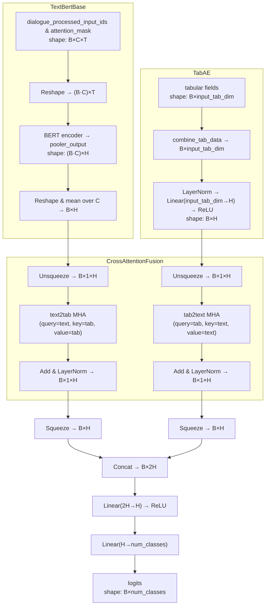

---
tags:
  - code
  - code_snippet
  - buyer_seller_messaging
  - multi-modal_learning
  - multi-modal_cross_attention
  - cross_attention_layer
keywords: 
topics: 
language: python
date of note: 2025-04-28
---

## Code Snippet Summary

>[!important]
>This script contains the BERT class for *text classification*
>- Shared with [[Multi-modal BERT for FSDP Model Parallelism]] 
>	- The **model parallelism** implementation
>	- Use **FSDP (Fully Sharded Data Parallel) Strategy** in Pytorch lightning
>- Contribution
>	- Handle multimodality via **Cross-Attention mechanism**


- [[Multi-modal BERT for FSDP Model Parallelism]]
- [[Attention Mechanism in Neural Network]]
- [[Transformer Network]]
- [[Residual Connection for Deep Learning]]



### Cross Attention Mechanism

>[!important]
>Let $h^t, h^a \in \mathbb{R}^H$ be the text and tabular embeddings, respectively
>- We treat each embedding as a sequence of length 1 so it can feed into a standard multi-head attention block. 
>$$
>\begin{aligned} 
>&X = \bigl[h^t\bigr] \in \mathbb{R}^{1\times H},  \qquad A = \bigl[h^a\bigr] \in \mathbb{R}^{1\times H}.\\[6pt]\end{aligned} 
>$$
>- Define Multi‐Head Attention:  $$\mathrm{MHA}(Q,K,V)\;:\;\mathbb{R}^{\ell_Q\times H}\times\mathbb{R}^{\ell_K\times H}\times\mathbb{R}^{\ell_V\times H} \to \mathbb{R}^{\ell_Q\times H}.$$
>- **Text attends to Tab** or **Text → Tabular attention** $$U^t \;=\;\mathrm{MHA}\bigl(Q = X,\;K = A,\;V = A\bigr)$$ 
>	-  **Query** $X$ (the text embedding) “looks at”
>	- **Keys** and **Values** coming from $A$ (the tabular embedding).  
>	- The result $U^t\in\mathbb R^{1\times H}$ is how the *text* branch has *borrowed information* from the *tabular* branch.
>	- $U^{t}$ is in the subspace spanned by the *tabular embeddings*
>- **Residual + LayerNorm on text** $$\widetilde X \;=\;\mathrm{LayerNorm}\bigl(X + U^t\bigr)$$
>	- We add the attention output back to the original text embedding, then normalize. 
>	- This yields an *enriched text representation*
>	- This is a **cross-modal residual**: you keep the original text representation while injecting tabular information into it.
>	- Concretely:
>		- $X$ is the **original text** embedding (purely from the text encoder).
>		- $U^t$ is the **tabular‐derived** signal (the result of “text attending to tabular”).
>- **Tab attends to Text** or **Tabular → Text attention** $$U^a \;=\;\mathrm{MHA}\bigl(Q = A,\;K = \widetilde X,\;V = \widetilde X\bigr),$$ 
>	- Now the **tabular** embedding $A$ queries the **updated text** $\widetilde X$, producing $U^a$.
>	- $U^{a}$ is in the subspace spanned by the *text embeddings*
>- **Residual + LayerNorm on tabular** $$\widetilde A \;=\;\mathrm{LayerNorm}\bigl(A + U^a\bigr)$$
>	- This **fuses** the tabular branch with *text-derived information*.
>	- Same as above **cross-modal residual**.
>- **Squeeze back to vectors** $$\hat h^t = \widetilde X_{:,0}\in\mathbb R^H, \quad \hat h^a = \widetilde A_{:,0}\in\mathbb R^H.$$
>	- Since each was a length-1 sequence, we take the sole element (index 0) to get back to plain $H$-dimensional vectors.
>- **Concatenate and classify** $$z = \begin{bmatrix}\hat h^t \\ \hat h^a\end{bmatrix} \in \mathbb{R}^{2H}, \qquad \text{logits} = W_2\bigl(\mathrm{ReLU}(W_1\,z)\bigr) \in \mathbb{R}^{\text{num\_classes}}.$$
>	- Finally we stack the two fused embeddings into one $2H$-vector, 
>	- pass it through a small MLP ($\mathrm{ReLU}(W_1\,\cdot)$ then $W_2$​) to produce the class logits.


## Code

```python
#!/usr/bin/env python3
import json
import pandas as pd
from pathlib import Path
from datetime import datetime
from typing import Dict, List, Union
import logging
```

```python
import torch
import torch.nn as nn
from torch.optim import AdamW
from torch.distributed.fsdp import FullyShardedDataParallel as FSDP

import lightning.pytorch as pl


from transformers import (
    get_linear_schedule_with_warmup,
    get_constant_schedule_with_warmup,
)
import onnx
```


```python
from .dist_utils import all_gather
from .pl_tab_ae import TabAE
from .pl_bert import TextBertBase
from .pl_model_plots import compute_metrics
```

### Logger

```python
# =================== Logging Setup =================================
logger = logging.getLogger(__name__)
logger.setLevel(logging.INFO)

handler = logging.StreamHandler()
handler.setLevel(logging.INFO)
formatter = logging.Formatter("%(levelname)s - %(message)s")
handler.setFormatter(formatter)
logger.addHandler(handler)
logger.propagate = False
```

### Cross-Attention Layer

```python
class CrossAttentionFusion(nn.Module):
    def __init__(self, hidden_dim: int, num_heads: int = 4):
        super().__init__()
        # text queries attend to tabular keys/values
        self.text2tab = nn.MultiheadAttention(embed_dim=hidden_dim, num_heads=num_heads, batch_first=True)
        # tabular queries attend to text keys/values
        self.tab2text = nn.MultiheadAttention(embed_dim=hidden_dim, num_heads=num_heads, batch_first=True)
        self.text_norm = nn.LayerNorm(hidden_dim)
        self.tab_norm  = nn.LayerNorm(hidden_dim)

    def forward(self, text_seq: torch.Tensor, tab_seq: torch.Tensor):
        # text_seq: [B, 1, H], tab_seq: [B, 1, H]
        # tab attends to text
        t2t, _ = self.text2tab(query=text_seq, key=tab_seq, value=tab_seq)
        # residual + layer norm
        text_out = self.text_norm(text_seq + t2t)
        # tab attends to updated text
        tab2, _   = self.tab2text(query=tab_seq, key=text_out, value=text_out)
        # residual + layer norm
        tab_out  = self.tab_norm(tab_seq + tab2)
        return text_out, tab_out
```

- **Cross-Attention mechanism**
	- **Text attend Tab**: output modified tabular embedding but *highlighted by* text query information
		- *query: text*
		- key: tab 
		- value: tab
	- **Tab attend Text**: output modified text embedding but *highlighted by* tabular query information
		- *query: tab*
		- key: *updated text* from step above 
		- value: *updated text*
	


### Multimodal BERT with Cross-Attention

```python
class MultimodalBertCrossAttn(pl.LightningModule):
    def __init__(self, config: Dict[str, Union[int, float, str, bool, List[str], torch.FloatTensor]]):
        super().__init__()
        self.config      = config
        self.model_class = "multimodal_cross_att"

        # — Core config —
        self.id_name      = config.get("id_name")
        self.label_name   = config["label_name"]
        self.text_input_ids_key   = config.get("text_input_ids_key", "input_ids")
        self.text_attention_mask_key = config.get("text_attention_mask_key", "attention_mask")
        self.text_name            = config["text_name"] + "_processed_" + self.text_input_ids_key
        self.text_attention_mask  = config["text_name"] + "_processed_" + self.text_attention_mask_key
        self.tab_field_list       = config.get("tab_field_list", [])

        self.is_binary    = config.get("is_binary", True)
        self.task         = "binary" if self.is_binary else "multiclass"
        self.num_classes  = 2 if self.is_binary else config.get("num_classes", 2)
        self.metric_choices = config.get("metric_choices", ["accuracy","f1_score"])

        if not self.is_binary and self.num_classes > 2:
            self.label_name_transformed = self.label_name + "_processed"
        else:
            self.label_name_transformed = self.label_name

        self.model_path    = config.get("model_path", "")
        self.lr            = config.get("lr", 2e-5)
        self.weight_decay  = config.get("weight_decay", 0.0)
        self.adam_epsilon  = config.get("adam_epsilon", 1e-8)
        self.warmup_steps  = config.get("warmup_steps", 0)
        self.run_scheduler = config.get("run_scheduler", True)

        # For preds/labels collection
        self.id_lst, self.pred_lst, self.label_lst = [], [], []
        self.test_output_folder = None
        self.test_has_label     = False

        # — Sub-networks —
        self.tab_subnetwork  = TabAE(config) if self.tab_field_list else None
        tab_dim              = self.tab_subnetwork.output_tab_dim if self.tab_subnetwork else 0

        self.text_subnetwork = TextBertBase(config)
        text_dim             = self.text_subnetwork.output_text_dim

        # — Cross-attention fusion —
        hidden_dim = config["hidden_common_dim"]
        num_heads  = config.get("num_heads", 4)
        # ensure both branches embed to same hidden_dim:
        assert text_dim == hidden_dim and tab_dim == hidden_dim, \
            f"text_dim ({text_dim}) and tab_dim ({tab_dim}) must both = hidden_common_dim ({hidden_dim})"
        self.cross_att = CrossAttentionFusion(hidden_dim, num_heads)

        # — Final classifier on concat([text,tab]) after fusion —
        self.final_merge_network = nn.Sequential(
            nn.Linear(hidden_dim * 2, hidden_dim),
            nn.ReLU(),
            nn.Linear(hidden_dim, self.num_classes),
        )

        # — Loss function —
        weights = config.get("class_weights", [1.0] * self.num_classes)
        if len(weights) != self.num_classes:
            logger.warning(f"class_weights length {len(weights)} != num_classes {self.num_classes}; auto-padding")
            weights = weights + [1.0] * (self.num_classes - len(weights))
        wt = torch.tensor(weights[: self.num_classes], dtype=torch.float)
        self.register_buffer("class_weights_tensor", wt)
        self.loss_op = nn.CrossEntropyLoss(weight=self.class_weights_tensor)

        self.save_hyperparameters()

    def forward(self, batch: Dict[str, torch.Tensor]) -> torch.Tensor:
        tab_data = (
            self.tab_subnetwork.combine_tab_data(batch).float()
            if self.tab_subnetwork
            else None
        )
        return self._forward_impl(batch, tab_data)

    def _forward_impl(self, batch, tab_data) -> torch.Tensor:
        device = next(self.parameters()).device

        # — Text branch — [B, hidden_dim]
        text_out = self.text_subnetwork(batch)

        # — Tabular branch — [B, hidden_dim]
        if tab_data is not None:
            tab_out = self.tab_subnetwork(tab_data.to(device))
        else:
            tab_out = torch.zeros((text_out.size(0), 0), device=device)

        # — unsqueeze to seq-length=1 —
        text_seq = text_out.unsqueeze(1)  # [B, 1, H]
        tab_seq  = tab_out.unsqueeze(1)   # [B, 1, H]

        # — cross-attention fusion —
        text_fused, tab_fused = self.cross_att(text_seq, tab_seq)
        # => both [B,1,H]

        # — squeeze back to [B,H] —
        text_feat = text_fused.squeeze(1)  # [B, H]
        tab_feat  = tab_fused.squeeze(1)   # [B, H]

        # — concat & classify —
        merged = torch.cat([text_feat, tab_feat], dim=1)  # [B, 2H]
        logits = self.final_merge_network(merged)         # [B, num_classes]
        return logits

    def configure_optimizers(self):
        no_decay = ["bias","LayerNorm.weight"]
        params = [
            {
                "params": [p for n,p in self.named_parameters() if not any(nd in n for nd in no_decay)],
                "weight_decay": self.weight_decay,
            },
            {
                "params": [p for n,p in self.named_parameters() if any(nd in n for nd in no_decay)],
                "weight_decay": 0.0,
            },
        ]
        optimizer = AdamW(params, lr=self.lr, eps=self.adam_epsilon)

        scheduler = (
            get_linear_schedule_with_warmup(
                optimizer, self.warmup_steps, self.trainer.estimated_stepping_batches
            )
            if self.run_scheduler
            else get_constant_schedule_with_warmup(optimizer, num_warmup_steps=self.warmup_steps)
        )
        return {"optimizer": optimizer, "lr_scheduler": {"scheduler": scheduler, "interval": "step"}}

    def run_epoch(self, batch, stage):
        #labels = batch.get(self.label_name) if stage != "pred" else None
        labels = batch.get(self.label_name_transformed) if stage != "pred" else None

        if labels is not None:
            if not isinstance(labels, torch.Tensor):
                labels = torch.tensor(labels, device=self.device)
                
            # Important: CrossEntropyLoss always expects LongTensor (class index)
            if self.is_binary:
                labels = labels.long()  # Binary: Expects LongTensor (class indices)
            else:    
                # Multiclass: Check if labels are one-hot encoded
                if labels.dim() > 1:  # Assuming one-hot is 2D
                    labels = labels.argmax(dim=1).long()  # Convert one-hot to indices
                else:
                    labels = labels.long()  # Multiclass: Expects LongTensor (class indices)

        tab_data = self.tab_subnetwork.combine_tab_data(batch) if self.tab_subnetwork else None

        logits = self._forward_impl(batch, tab_data)
        loss = self.loss_op(logits, labels) if stage != "pred" else None

        preds = torch.softmax(logits, dim=1)
        preds = preds[:, 1] if self.is_binary else preds
        return loss, preds, labels

    def training_step(self, batch, batch_idx):
        loss, _, _ = self.run_epoch(batch, "train")
        self.log("train_loss", loss, sync_dist=True, prog_bar=True)
        return {"loss": loss}

    def on_validation_epoch_start(self):
        self.pred_lst.clear()
        self.label_lst.clear()

    def validation_step(self, batch, batch_idx):
        loss, preds, labels = self.run_epoch(batch, "val")
        self.log("val_loss", loss, sync_dist=True, prog_bar=True)
        self.pred_lst.extend(preds.detach().cpu().tolist())
        self.label_lst.extend(labels.detach().cpu().tolist())

    def on_validation_epoch_end(self):
        # Sync across GPUs
        device = self.device
        preds = torch.tensor(sum(all_gather(self.pred_lst), []))
        labels = torch.tensor(sum(all_gather(self.label_lst), []))
        metrics = compute_metrics(
            preds.to(device), labels.to(device), self.metric_choices, self.task, self.num_classes, "val"
        )
        self.log_dict(metrics, prog_bar=True)

    def test_step(self, batch, batch_idx):
        mode = "test" if self.label_name in batch else "pred"
        self.test_has_label = mode == "test"

        loss, preds, labels = self.run_epoch(batch, mode)
        self.pred_lst.extend(preds.detach().cpu().tolist())
        if labels is not None:
            self.label_lst.extend(labels.detach().cpu().tolist())
        self.log("test_loss", loss, sync_dist=True, prog_bar=True)
        if self.id_name:
            self.id_lst.extend(batch[self.id_name])

    def on_test_epoch_start(self):
        self.id_lst.clear()
        self.pred_lst.clear()
        self.label_lst.clear()
        timestamp = datetime.now().strftime("%Y-%m-%d-%H-%M-%S")
        self.test_output_folder = Path(self.model_path) / f"{self.model_class}-{timestamp}"
        self.test_output_folder.mkdir(parents=True, exist_ok=True)


    def on_test_epoch_end(self):
        import pandas as pd

        # Save only local results per GPU
        results = {}
        if self.is_binary:
            results["prob"] = self.pred_lst  # Keep "prob" for binary
        else:
            results["prob"] = [json.dumps(p) for p in self.pred_lst] # convert the [num_class] list into a string
        
        #results = {"prob": self.pred_lst}
        if self.test_has_label:
            results["label"] = self.label_lst
        if self.id_name:
            results[self.id_name] = self.id_lst

        df = pd.DataFrame(results)
        test_file = self.test_output_folder / f"test_result_rank{self.global_rank}.tsv"
        df.to_csv(test_file, sep="\t", index=False)
        print(f"[Rank {self.global_rank}] Saved test results to {test_file}")
        

    def predict_step(self, batch, batch_idx, dataloader_idx=0):
        mode = "test" if self.label_name in batch else "pred"
        _, preds, labels = self.run_epoch(batch, mode)
        return (preds, labels) if mode == "test" else preds


    def export_to_onnx(self, save_path: Union[str, Path], sample_batch: Dict[str, Union[torch.Tensor,List]]):
        class Wrapper(nn.Module):
            def __init__(self, model):
                super().__init__()
                self.model   = model
                self.text_k  = model.text_name
                self.mask_k  = model.text_attention_mask
                self.tab_keys= model.tab_field_list or []

            def forward(self, input_ids, attention_mask, *tab_tensors):
                batch = {self.text_k: input_ids, self.mask_k: attention_mask}
                for k, t in zip(self.tab_keys, tab_tensors):
                    batch[k] = t
                logits = self.model(batch)
                return nn.functional.softmax(logits, dim=1)

        self.eval()
        m = self.module if isinstance(self, FSDP) else self
        wrapper = Wrapper(m.to("cpu")).eval()

        # prepare inputs
        input_names   = [self.text_name, self.text_attention_mask]
        input_tensors = [
            sample_batch[self.text_name].to("cpu"),
            sample_batch[self.text_attention_mask].to("cpu"),
        ]
        batch_size = input_tensors[0].shape[0]

        for name in self.tab_field_list:
            input_names.append(name)
            v = sample_batch[name]
            t = v.to("cpu").float() if isinstance(v,torch.Tensor)\
                else torch.tensor(v,dtype=torch.float32).view(batch_size,-1)
            input_tensors.append(t)

        # dynamic axes for inputs & output
        dynamic_axes = {n: {0:"batch", **{i:f"dim_{i}" for i in range(1,t.ndim)}} 
                        for n,t in zip(input_names, input_tensors)}
        dynamic_axes["probs"] = {0:"batch"}

        torch.onnx.export(
            wrapper,
            tuple(input_tensors),
            str(save_path),
            input_names=input_names,
            output_names=["probs"],
            dynamic_axes=dynamic_axes,
            opset_version=14,
        )
        onnx_model = onnx.load(str(save_path))
        onnx.checker.check_model(onnx_model)
        logger.info(f"ONNX export verified at {save_path}")
```

### Major Update

```python
    def __init__(self, config: Dict[str, Union[int, float, str, bool, List[str], torch.FloatTensor]]):
		...
		# — Sub-networks —
        self.tab_subnetwork  = TabAE(config) if self.tab_field_list else None
        tab_dim              = self.tab_subnetwork.output_tab_dim if self.tab_subnetwork else 0

        self.text_subnetwork = TextBertBase(config)
        text_dim             = self.text_subnetwork.output_text_dim

        # — Cross-attention fusion —
        hidden_dim = config["hidden_common_dim"]
        num_heads  = config.get("num_heads", 4)
        # ensure both branches embed to same hidden_dim:
        assert text_dim == hidden_dim and tab_dim == hidden_dim, \
            f"text_dim ({text_dim}) and tab_dim ({tab_dim}) must both = hidden_common_dim ({hidden_dim})"
        self.cross_att = CrossAttentionFusion(hidden_dim, num_heads)

        # — Final classifier on concat([text,tab]) after fusion —
        self.final_merge_network = nn.Sequential(
            nn.Linear(hidden_dim * 2, hidden_dim),
            nn.ReLU(),
            nn.Linear(hidden_dim, self.num_classes),
        )
```

### Major Update: Forward Pass

```python
    def forward(self, batch: Dict[str, torch.Tensor]) -> torch.Tensor:
        tab_data = (
            self.tab_subnetwork.combine_tab_data(batch).float()
            if self.tab_subnetwork
            else None
        )
        return self._forward_impl(batch, tab_data)
```

```python
    def _forward_impl(self, batch, tab_data) -> torch.Tensor:
        device = next(self.parameters()).device

        # — Text branch — [B, hidden_dim]
        text_out = self.text_subnetwork(batch)

        # — Tabular branch — [B, hidden_dim]
        if tab_data is not None:
            tab_out = self.tab_subnetwork(tab_data.to(device))
        else:
            tab_out = torch.zeros((text_out.size(0), 0), device=device)

        # — unsqueeze to seq-length=1 —
        text_seq = text_out.unsqueeze(1)  # [B, 1, H]
        tab_seq  = tab_out.unsqueeze(1)   # [B, 1, H]

        # — cross-attention fusion —
        text_fused, tab_fused = self.cross_att(text_seq, tab_seq)
        # => both [B,1,H]

        # — squeeze back to [B,H] —
        text_feat = text_fused.squeeze(1)  # [B, H]
        tab_feat  = tab_fused.squeeze(1)   # [B, H]

        # — concat & classify —
        merged = torch.cat([text_feat, tab_feat], dim=1)  # [B, 2H]
        logits = self.final_merge_network(merged)         # [B, num_classes]
        return logits
```


## FAQ

>[!question]
>why do we use the output of *updated text* instead of *original text* during the second cross-attention step?

>[!info] 
> The whole point of the **two‐step cross‐attention** is to let each modality iteratively enrich the other. 
> - If in step 6 you simply attended the tabular embedding $A$ to the **original** text $X$, you would be ignoring the new “tabular signal” that you just injected into the text branch in step 5.
> 
> By using $$\widetilde X = \mathrm{LayerNorm}(X + U^t)$$ as the **keys** and **values** for the *tabular query*, you ensure that when the *tabular* embedding *looks back* at the *text*, it sees a representation that already contains the *relevant tabular context*. In effect:
> 
> 1. **Step 4–5**: Text “reads from” tabular → produces $U^t$ → fuses back to get $\widetilde X$.
>     
> 2. **Step 6–7**: Tabular “reads from” the _enriched_ text $\widetilde X$ → produces $U^a$ → fuses back to get $\widetilde A$.
>     
> 
> This two‐phase scheme lets the modalities **mutually** inform each other. If you skipped using $\widetilde X$ and instead used the stale $X$, you’d only have one‐way fusion. 
> - By chaining them—first **text→tab**, then **tab→(text→tab)**—you get a **symmetrically updated pair** $(\widetilde X,\widetilde A)$ that both carry cross‐modal context.


-----------
##  Recommended Notes


- [[Bidirectional Encoder Representation from Transformer or BERT]]

- [[AtoZ BSM Model Training Script]]
- [[AtoZ BSM MODS script]]