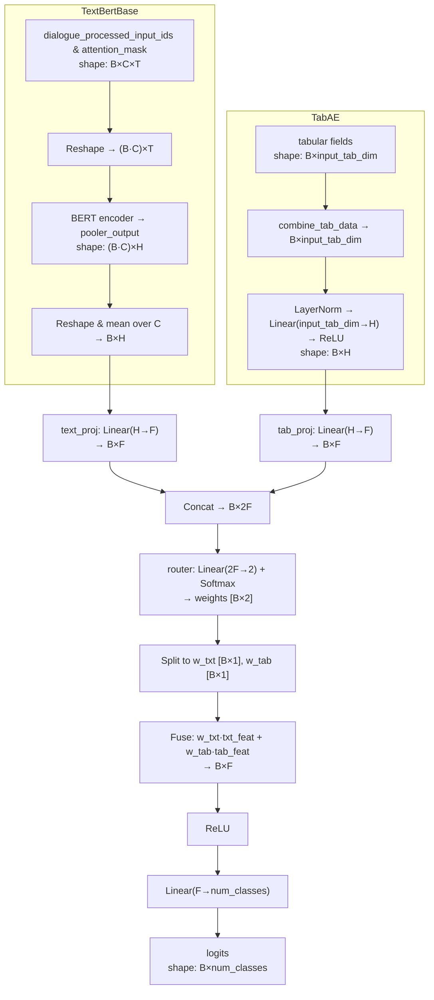

---
tags:
  - code
  - code_snippet
  - buyer_seller_messaging
  - multi-modal_learning
  - mixture_of_experts
  - multi-modal_mixture_of_experts
keywords: 
topics: 
language: python
date of note: 2025-04-28
---

## Code Snippet Summary

>[!important]
>This script contains the BERT class for *text classification*
>- Shared with [[Multi-modal BERT for FSDP Model Parallelism]] 
>	- The **model parallelism** implementation
>	- Use **FSDP (Fully Sharded Data Parallel) Strategy** in Pytorch lightning
>- Contribution
>	- Handle multimodality via **Mixture-of-Expert** mechanism


- [[Multi-modal BERT for FSDP Model Parallelism]]
- [[Mixture of Experts or MoE as Deep Ensemble Learning]]
- [[Switch Transformer via Mixture of Expert Layer]]



## Code

```python
import json
import pandas as pd
from pathlib import Path
from datetime import datetime
from typing import Dict, List, Union
import logging
```

```python
import torch
import torch.nn as nn
from torch.optim import AdamW
from torch.distributed.fsdp import FullyShardedDataParallel as FSDP

import lightning.pytorch as pl

from transformers import (
    get_linear_schedule_with_warmup,
    get_constant_schedule_with_warmup,
)
import onnx
```

```python
from .dist_utils import all_gather, get_rank
from .pl_tab_ae import TabAE
from .pl_bert import TextBertBase
from .pl_model_plots import compute_metrics
```

### Logger

```python
# =================== Logging Setup =================================
logger = logging.getLogger(__name__)
logger.setLevel(logging.INFO)
handler = logging.StreamHandler()
handler.setLevel(logging.INFO)
handler.setFormatter(logging.Formatter("%(levelname)s - %(message)s"))
logger.addHandler(handler)
logger.propagate = False
```

### Mixture of Expert Module

```python
class MixtureOfExperts(nn.Module):
    """
    Mixture of Experts module to combine text and tabular features.
    """
    def __init__(self, text_dim, tab_dim, fusion_dim):
        super().__init__()
        self.text_proj = nn.Linear(text_dim, fusion_dim) if text_dim != fusion_dim else nn.Identity()
        self.tab_proj = nn.Linear(tab_dim, fusion_dim) if tab_dim != fusion_dim else nn.Identity()
        self.router = nn.Sequential(
            nn.Linear(fusion_dim * 2, 2),
            nn.Softmax(dim=-1)
        )

    def forward(self, text_features, tab_features):
        # Project features to the same dimension
        txt_feat = self.text_proj(text_features)
        tab_feat = self.tab_proj(tab_features)
        # Compute routing weights
        concat_experts = torch.cat([txt_feat, tab_feat], dim=1)
        weights = self.router(concat_experts)
        # Weighted combination of experts
        w_txt = weights[:, 0].unsqueeze(1)
        w_tab = weights[:, 1].unsqueeze(1)
        fused = w_txt * txt_feat + w_tab * tab_feat
        return fused
```

- In mixture-of-expert module, we have
	- the **router network** $$p := [p_{0}, p_{1}] := \text{softmax} \left( W_{\text{router}}\,[W_{\text{text}}\,x_{\text{text}}, W_{\text{tab}}\,x_{\text{tab}} ] \right)$$
	- the **expert networks** $$W_{\text{tab}}\,x_{\text{tab}},\;\; W_{\text{text}}\,x_{\text{text}}$$
	- the **fusion network** $$f_{\text{fuse}} = p_{0}\,W_{\text{tab}}\,x_{\text{tab}} + p_{1}\,W_{\text{text}}\,x_{\text{text}}$$

### Multi-modal BERT via Mixture of Expert

```python
class MultimodalBertMoE(pl.LightningModule):
    def __init__(self, config: Dict[str, Union[int, float, str, bool, List[str], torch.FloatTensor]]):
        super().__init__()
        self.config      = config
        self.model_class = "multimodal_moe"

        # === Core configuration ===
        self.id_name      = config.get("id_name", None)
        self.label_name   = config["label_name"]
        self.text_input_ids_key   = config.get("text_input_ids_key", "input_ids")
        self.text_attention_mask_key = config.get("text_attention_mask_key", "attention_mask")
        self.text_name            = config["text_name"] + "_processed_" + self.text_input_ids_key
        self.text_attention_mask  = config["text_name"] + "_processed_" + self.text_attention_mask_key
        self.tab_field_list       = config.get("tab_field_list", [])

        self.is_binary   = config.get("is_binary", True)
        self.task        = "binary" if self.is_binary else "multiclass"
        self.num_classes = 2 if self.is_binary else config.get("num_classes", 2)
        self.metric_choices = config.get("metric_choices", ["accuracy", "f1_score"])

        if not self.is_binary and self.num_classes > 2:
            self.label_name_transformed = self.label_name + "_processed"
        else:
            self.label_name_transformed = self.label_name

        self.model_path    = config.get("model_path", "")
        self.lr            = config.get("lr", 2e-5)
        self.weight_decay  = config.get("weight_decay", 0.0)
        self.adam_epsilon  = config.get("adam_epsilon", 1e-8)
        self.warmup_steps  = config.get("warmup_steps", 0)
        self.run_scheduler = config.get("run_scheduler", True)

        # For storing preds/labels
        self.id_lst, self.pred_lst, self.label_lst = [], [], []
        self.test_output_folder = None
        self.test_has_label     = False

        # === Sub-networks ===
        self.tab_subnetwork  = TabAE(config) if self.tab_field_list else None
        tab_dim              = self.tab_subnetwork.output_tab_dim if self.tab_subnetwork else 0

        self.text_subnetwork = TextBertBase(config)
        text_dim             = self.text_subnetwork.output_text_dim

        # === Mixture-of-Experts fusion ===
        fusion_dim = config.get("fusion_dim", max(text_dim, tab_dim))
        self.moe_fusion = MixtureOfExperts(text_dim, tab_dim, fusion_dim)

        # Final classifier on fused vector
        self.classifier = nn.Sequential(
            nn.ReLU(),
            nn.Linear(fusion_dim, self.num_classes),
        )

        # === Loss function ===
        weights = config.get("class_weights", [1.0] * self.num_classes)
        if len(weights) != self.num_classes:
            logger.warning(f"class_weights length {len(weights)} != num_classes {self.num_classes}; auto-padding")
            weights = weights + [1.0] * (self.num_classes - len(weights))
        wt = torch.tensor(weights[: self.num_classes], dtype=torch.float)
        self.register_buffer("class_weights_tensor", wt)
        self.loss_op = nn.CrossEntropyLoss(weight=self.class_weights_tensor)

        self.save_hyperparameters()

    def forward(self, batch: Dict[str, torch.Tensor]) -> torch.Tensor:
        # prepare tabular data if present
        tab_data = (
            self.tab_subnetwork.combine_tab_data(batch).float()
            if self.tab_subnetwork
            else None
        )
        return self._forward_impl(batch, tab_data)

    def _forward_impl(self, batch, tab_data) -> torch.Tensor:
        device = next(self.parameters()).device

        # — Text expert — [B, text_dim]
        text_out = self.text_subnetwork(batch)

        # — Tabular expert — [B, tab_dim]
        if tab_data is not None:
            tab_out = self.tab_subnetwork(tab_data.to(device))
        else:
            tab_out = torch.zeros_like(text_out)

        # — Mixture-of-Experts fusion —
        fused = self.moe_fusion(text_out, tab_out)

        # — Classification — [B, num_classes]
        logits = self.classifier(fused)
        return logits

    def configure_optimizers(self):
        no_decay = ["bias", "LayerNorm.weight"]
        params = [
            {
                "params": [p for n,p in self.named_parameters() if not any(nd in n for nd in no_decay)],
                "weight_decay": self.weight_decay,
            },
            {
                "params": [p for n,p in self.named_parameters() if     any(nd in n for nd in no_decay)],
                "weight_decay": 0.0,
            },
        ]
        optimizer = AdamW(params, lr=self.lr, eps=self.adam_epsilon)

        scheduler = (
            get_linear_schedule_with_warmup(
                optimizer, self.warmup_steps, self.trainer.estimated_stepping_batches
            )
            if self.run_scheduler
            else get_constant_schedule_with_warmup(
                optimizer, num_warmup_steps=self.warmup_steps
            )
        )
        return {"optimizer": optimizer, "lr_scheduler": {"scheduler": scheduler, "interval": "step"}}

    def run_epoch(self, batch, stage):
        #labels = batch.get(self.label_name) if stage != "pred" else None
        labels = batch.get(self.label_name_transformed) if stage != "pred" else None

        if labels is not None:
            if not isinstance(labels, torch.Tensor):
                labels = torch.tensor(labels, device=self.device)
                
            # Important: CrossEntropyLoss always expects LongTensor (class index)
            if self.is_binary:
                labels = labels.long()  # Binary: Expects LongTensor (class indices)
            else:    
                # Multiclass: Check if labels are one-hot encoded
                if labels.dim() > 1:  # Assuming one-hot is 2D
                    labels = labels.argmax(dim=1).long()  # Convert one-hot to indices
                else:
                    labels = labels.long()  # Multiclass: Expects LongTensor (class indices)

        tab_data = self.tab_subnetwork.combine_tab_data(batch) if self.tab_subnetwork else None

        logits = self._forward_impl(batch, tab_data)
        loss = self.loss_op(logits, labels) if stage != "pred" else None

        preds = torch.softmax(logits, dim=1)
        preds = preds[:, 1] if self.is_binary else preds
        return loss, preds, labels

    def training_step(self, batch, batch_idx):
        loss, _, _ = self.run_epoch(batch, "train")
        self.log("train_loss", loss, sync_dist=True, prog_bar=True)
        return {"loss": loss}

    def on_validation_epoch_start(self):
        self.pred_lst.clear()
        self.label_lst.clear()

    def validation_step(self, batch, batch_idx):
        loss, preds, labels = self.run_epoch(batch, "val")
        self.log("val_loss", loss, sync_dist=True, prog_bar=True)
        self.pred_lst.extend(preds.detach().cpu().tolist())
        self.label_lst.extend(labels.detach().cpu().tolist())

    def on_validation_epoch_end(self):
        # Sync across GPUs
        device = self.device
        preds = torch.tensor(sum(all_gather(self.pred_lst), []))
        labels = torch.tensor(sum(all_gather(self.label_lst), []))
        metrics = compute_metrics(
            preds.to(device), labels.to(device), self.metric_choices, self.task, self.num_classes, "val"
        )
        self.log_dict(metrics, prog_bar=True)

    def test_step(self, batch, batch_idx):
        mode = "test" if self.label_name in batch else "pred"
        self.test_has_label = mode == "test"

        loss, preds, labels = self.run_epoch(batch, mode)
        self.pred_lst.extend(preds.detach().cpu().tolist())
        if labels is not None:
            self.label_lst.extend(labels.detach().cpu().tolist())
        self.log("test_loss", loss, sync_dist=True, prog_bar=True)
        if self.id_name:
            self.id_lst.extend(batch[self.id_name])

    def on_test_epoch_start(self):
        self.id_lst.clear()
        self.pred_lst.clear()
        self.label_lst.clear()
        timestamp = datetime.now().strftime("%Y-%m-%d-%H-%M-%S")
        self.test_output_folder = Path(self.model_path) / f"{self.model_class}-{timestamp}"
        self.test_output_folder.mkdir(parents=True, exist_ok=True)


    def on_test_epoch_end(self):
        import pandas as pd

        # Save only local results per GPU
        results = {}
        if self.is_binary:
            results["prob"] = self.pred_lst  # Keep "prob" for binary
        else:
            results["prob"] = [json.dumps(p) for p in self.pred_lst] # convert the [num_class] list into a string
        
        #results = {"prob": self.pred_lst}
        if self.test_has_label:
            results["label"] = self.label_lst
        if self.id_name:
            results[self.id_name] = self.id_lst

        df = pd.DataFrame(results)
        test_file = self.test_output_folder / f"test_result_rank{self.global_rank}.tsv"
        df.to_csv(test_file, sep="\t", index=False)
        print(f"[Rank {self.global_rank}] Saved test results to {test_file}")
        

    def predict_step(self, batch, batch_idx, dataloader_idx=0):
        mode = "test" if self.label_name in batch else "pred"
        _, preds, labels = self.run_epoch(batch, mode)
        return (preds, labels) if mode == "test" else preds


    def export_to_onnx(self, save_path: Union[str, Path], sample_batch: Dict[str, Union[torch.Tensor, List]]):
        class Wrapper(nn.Module):
            def __init__(self, model):
                super().__init__()
                self.model   = model
                self.text_k  = model.text_name
                self.mask_k  = model.text_attention_mask
                self.tab_keys= model.tab_field_list or []

            def forward(self, input_ids, attention_mask, *tab_tensors):
                b = {self.text_k: input_ids, self.mask_k: attention_mask}
                for k,t in zip(self.tab_keys, tab_tensors):
                    b[k] = t
                logits = self.model(b)
                return nn.functional.softmax(logits, dim=1)

        self.eval()
        m = self.module if isinstance(self, FSDP) else self
        wrapper = Wrapper(m.to("cpu")).eval()

        # prepare input names & tensors
        input_names   = [self.text_name, self.text_attention_mask]
        input_tensors = [
            sample_batch[self.text_name].to("cpu"),
            sample_batch[self.text_attention_mask].to("cpu"),
        ]
        B = input_tensors[0].shape[0]

        for name in self.tab_field_list:
            input_names.append(name)
            v = sample_batch[name]
            t = v.to("cpu").float() if isinstance(v,torch.Tensor) \
                else torch.tensor(v,dtype=torch.float32).view(B,-1)
            input_tensors.append(t)

        # dynamic axes
        dynamic_axes = {
            n: {0:"batch", **{i:f"dim_{i}" for i in range(1,t.ndim)}} 
            for n,t in zip(input_names, input_tensors)
        }
        dynamic_axes["probs"] = {0:"batch"}

        torch.onnx.export(
            wrapper,
            tuple(input_tensors),
            str(save_path),
            input_names=input_names,
            output_names=["probs"],
            dynamic_axes=dynamic_axes,
            opset_version=14,
        )
        onnx_model = onnx.load(str(save_path))
        onnx.checker.check_model(onnx_model)
        logger.info(f"ONNX model exported and verified at {save_path}")
```

### Major Update: Initialization

```python
    def __init__(self, config: Dict[str, Union[int, float, str, bool, List[str], torch.FloatTensor]]):
	    ...
        # === Sub-networks ===
        self.tab_subnetwork  = TabAE(config) if self.tab_field_list else None
        tab_dim              = self.tab_subnetwork.output_tab_dim if self.tab_subnetwork else 0

        self.text_subnetwork = TextBertBase(config)
        text_dim             = self.text_subnetwork.output_text_dim

        # === Mixture-of-Experts fusion ===
        fusion_dim = config.get("fusion_dim", max(text_dim, tab_dim))
        self.moe_fusion = MixtureOfExperts(text_dim, tab_dim, fusion_dim)

        # Final classifier on fused vector
        self.classifier = nn.Sequential(
            nn.ReLU(),
            nn.Linear(fusion_dim, self.num_classes),
        )
```

### Major Update: Forward Pass

```python
    def forward(self, batch: Dict[str, torch.Tensor]) -> torch.Tensor:
        # prepare tabular data if present
        tab_data = (
            self.tab_subnetwork.combine_tab_data(batch).float()
            if self.tab_subnetwork
            else None
        )
        return self._forward_impl(batch, tab_data)
```


```python
    def _forward_impl(self, batch, tab_data) -> torch.Tensor:
        device = next(self.parameters()).device

        # — Text expert — [B, text_dim]
        text_out = self.text_subnetwork(batch)

        # — Tabular expert — [B, tab_dim]
        if tab_data is not None:
            tab_out = self.tab_subnetwork(tab_data.to(device))
        else:
            tab_out = torch.zeros_like(text_out)

        # — Mixture-of-Experts fusion —
        fused = self.moe_fusion(text_out, tab_out)

        # — Classification — [B, num_classes]
        logits = self.classifier(fused)
        return logits
```

- [[Multi-modal BERT via Fusion Gate]]

## Compare with Fusion Gate

| Aspect                 | Fusion Gate                                                                                                                                                                                                              | Mixture-of-Experts (MoE)                                                                                                                                                                                                       |
| ---------------------- | ------------------------------------------------------------------------------------------------------------------------------------------------------------------------------------------------------------------------ | ------------------------------------------------------------------------------------------------------------------------------------------------------------------------------------------------------------------------------ |
| **Core Mechanism**     | Computes a **per-dimension** sigmoid gate $g\in[0,1]^F$ over concatenated projections: $$g = \sigma(W_g [h_{\text{text}};h_{\text{tab}}])$$<br>$$h_{\text{fused}} = g\odot h_{\text{text}} + (1-g)\odot h_{\text{tab}}$$ | Computes a **global** softmax router over concatenated projections:<br><br>$$w = \mathrm{softmax}(W_r [h_{\text{text}};h_{\text{tab}}])\in\Delta^2,$$<br><br>$$h_{\text{fused}} = w_1\,h_{\text{text}} + w_2\,h_{\text{tab}}$$ |
| **Granularity**        | **Fine-grained**: each of the FFF fused features has its own gate value.                                                                                                                                                 | **Coarse**: *one mixing weight* per modality (text vs. tab) shared across all features.                                                                                                                                        |
| **Parameterization**   | • *Two projections*: $$D\to F$$each  <br>• **Gate net**: Linear(2F→F) + Sigmoid                                                                                                                                          | • *Two projections*: $$D\to F$$each  <br>• **Router**: Linear(2F→2) + Softmax                                                                                                                                                  |
| **Parameter Count**    | $$\approx 2D\,F + 2F^2 + F$$                                                                                                                                                                                             | $$\approx 2D\,F + 4F + 2F^2$$ (same order)                                                                                                                                                                                     |
| **Compute Overhead**   | • One extra Linear(2F→F) + *elementwise* multiply/add                                                                                                                                                                    | • One extra Linear(2F→2) + two *scalar–vector multiplications* per sample                                                                                                                                                      |
| **Interpretability**   | You can inspect *each gate component* $g_i$​ to see which features rely more on text vs. tab.                                                                                                                            | You get a *single* $$[w_{\text{text}},w_{\text{tab}}]$$*per sample*—easy to report overall.                                                                                                                                    |
| **Training Stability** | More gating parameters may require tuning but allow precise, **per-feature control**.                                                                                                                                    | Fewer gating parameters often converge more *stably* when one modality generally dominates.                                                                                                                                    |
| **When to Use**        | • When modalities bring **complementary** information along different feature axes.  <br>• You want **feature-level control**.                                                                                           | • When you need **global**, per-sample re-weighting (e.g., down-weight noisy text or tab).                                                                                                                                     |

**Summary**

- **Fusion Gate** gives you a **vector of gates** $g\in(0,1)^F$, so each fused feature can **independently** favor text or tabular embeddings—ideal for finely complementary modalities.
    
- **MoE** fusion yields a **single** pair of weights $(w_{\text{text}},w_{\text{tab}})$ per sample, enforcing a **uniform “global” blend**—simpler and often more stable when one modality tends to dominate.


-----------
##  Recommended Notes


- [[AtoZ BSM Model Training Script]]
- [[AtoZ BSM MODS script]]