---
tags:
  - entry_point
  - design/design_architecture
  - aws/sagemaker_pipeline
aliases: 
date of note: 2025-07-04
---

## Layered Abstraction (Specification-Driven Design)

```mermaid
flowchart TD
    subgraph "📓 User Interface Layer"
        NotebookWorkflow["Jupyter Notebook Workflow<br/>• 10 sections for 10 step configs<br/>• Interactive config creation<br/>• Markdown documentation<br/>• Cell-by-cell development"]
        ConfigCreation["Config Object Creation<br/>• CradleDataLoadConfig()<br/>• TabularPreprocessingConfig()<br/>• XGBoostTrainingConfig()<br/>• Individual Pydantic instances"]
    end
    
    subgraph "💾 Configuration Persistence Layer"
        ConfigUtils["Configuration Utils (utils.py)<br/>• merge_and_save_configs()<br/>• Field categorization (shared/processing/specific)<br/>• Cross-type field detection<br/>• JSON serialization with metadata"]
        UnifiedJSON["Unified JSON Storage<br/>• shared: common fields<br/>• processing_shared: common processing<br/>• processing_specific: step-specific processing<br/>• specific: step-specific non-processing<br/>• metadata: config types & creation info"]
    end
    
    subgraph "🔄 Configuration Loading Layer"
        ConfigLoader["Configuration Loader (utils.py)<br/>• load_configs()<br/>• Priority hierarchy resolution<br/>• Pydantic reconstruction<br/>• Type validation & field defaults"]
        ConfigMap["Config Map Creation<br/>• Map step names to config instances<br/>• Handle job_type suffixes<br/>• Validate completeness"]
    end
    
    subgraph "🏗️ Pipeline Structure Layer"
        DAGDefinition["Pipeline DAG Definition<br/>• Manual node/edge specification<br/>• Topological sort capability<br/>• Dependency validation<br/>• Build order determination"]
        BuilderMapping["Step Builder Mapping<br/>• Map config types to builder classes<br/>• CradleDataLoading → CradleDataLoadingStepBuilder<br/>• TabularPreprocessing → TabularPreprocessingStepBuilder"]
    end
    
    subgraph "🎯 Pipeline Template Layer"
        PipelineTemplate["PipelineBuilderTemplate<br/>• Orchestrates entire build process<br/>• Validates inputs & dependencies<br/>• Manages step instantiation order<br/>• Handles I/O requirements & message propagation"]
    end
    
    subgraph "🔧 Step Builder Layer"
        StepBuilders["Individual Step Builders<br/>• Translate configs to SageMaker steps<br/>• Handle input/output requirements<br/>• Property path resolution<br/>• Custom property matching"]
    end
    
    subgraph "🔗 Dependency Resolution Layer"
        MessagePropagation["Message Propagation System<br/>• Logical name matching (input_names ↔ output_names)<br/>• Pattern matching fallbacks<br/>• Property path resolution<br/>• Manual dependency wiring"]
        PropertyResolution["Property Path Resolution<br/>• _resolve_property_path()<br/>• Handle SageMaker step properties<br/>• Extract S3 URIs from complex objects<br/>• Fallback mechanisms"]
    end
    
    subgraph "🚀 SageMaker Integration Layer"
        StepInstantiation["Step Instantiation<br/>• Create SageMaker Pipeline Steps<br/>• Apply resolved inputs/outputs<br/>• Handle step-specific configurations<br/>• Generate pipeline definition"]
        PipelineGeneration["Pipeline Generation<br/>• Combine all steps in topological order<br/>• Add pipeline parameters<br/>• Create final SageMaker Pipeline object"]
    end
    
    NotebookWorkflow --> ConfigCreation
    ConfigCreation --> ConfigUtils
    ConfigUtils --> UnifiedJSON
    UnifiedJSON --> ConfigLoader
    ConfigLoader --> ConfigMap
    ConfigMap --> DAGDefinition
    DAGDefinition --> BuilderMapping
    BuilderMapping --> PipelineTemplate
    PipelineTemplate --> StepBuilders
    StepBuilders --> MessagePropagation
    MessagePropagation --> PropertyResolution
    PropertyResolution --> StepInstantiation
    StepInstantiation --> PipelineGeneration
```




## User Input to Implementation Flow

```mermaid
flowchart TD
    %% User Input Phase
    UserStart["🧑‍💻 Data Scientist<br/>Starts new ML pipeline project"]
    
    UserStart --> NotebookSetup
    
    subgraph "📓 Configuration Development Phase"
        NotebookSetup["Setup Development Environment<br/>• Create Jupyter notebook<br/>• Plan pipeline architecture<br/>• Identify required step types"]
        
        ConfigCreation["Step-by-Step Config Creation<br/>• Create config objects for each pipeline step<br/>• Configure step-specific parameters<br/>• Handle job_type variations (training/testing/calibration)<br/>• Validate individual configurations"]
        
        ConfigCollection["Manual Config Aggregation<br/>all_configs = [step1_config, step2_config, ...]<br/>• Collect all step configurations<br/>• Ensure completeness<br/>• Manual list creation"]
    end
    
    NotebookSetup --> ConfigCreation
    ConfigCreation --> ConfigCollection
    ConfigCollection --> ConfigPersistence
    
    subgraph "💾 Configuration Persistence Phase"
        ConfigPersistence["merge_and_save_configs()<br/>• Serialize all Pydantic config objects<br/>• Intelligent field categorization<br/>• Handle cross-type field detection<br/>• Generate unified JSON structure"]
        
        UnifiedStorage["Unified Configuration Storage<br/>• shared: common fields across all configs<br/>• processing_shared: common processing fields<br/>• processing_specific: step-specific processing<br/>• specific: step-specific non-processing<br/>• metadata: config types & creation info"]
    end
    
    ConfigPersistence --> UnifiedStorage
    UnifiedStorage --> PipelineTemplateCreation
    
    subgraph "🏗️ Pipeline Template Creation Phase"
        PipelineTemplateCreation["Pipeline Template Development<br/>• Create template_pipeline_*.py file<br/>• Define pipeline-specific logic<br/>• Import required config & builder classes"]
        
        ConfigLoading["load_configs()<br/>• Read unified configuration JSON<br/>• Apply priority hierarchy resolution<br/>• Reconstruct Pydantic objects<br/>• Validate all configurations"]
        
        ConfigMapping["Config Discovery & Mapping<br/>• _find_config_key() by type & attributes<br/>• _find_config_by_type() for unique configs<br/>• Create step_name → config_instance mapping<br/>• Handle job_type suffixes"]
        
        DAGDefinition["Manual DAG Structure Definition<br/>nodes = [step1, step2, step3, ...]<br/>edges = [(step1, step2), (step2, step3), ...]<br/>• Define pipeline topology<br/>• Specify step dependencies"]
        
        BuilderMapping["Step Builder Class Mapping<br/>BUILDER_MAP = {<br/>  'StepType1': StepBuilder1,<br/>  'StepType2': StepBuilder2<br/>}<br/>• Map config types to builder classes"]
    end
    
    PipelineTemplateCreation --> ConfigLoading
    ConfigLoading --> ConfigMapping
    ConfigMapping --> DAGDefinition
    DAGDefinition --> BuilderMapping
    BuilderMapping --> TemplateInstantiation
    
    subgraph "🎯 Template Orchestration Phase"
        TemplateInstantiation["PipelineBuilderTemplate()<br/>• Initialize with DAG, config_map, builder_map<br/>• Validate inputs & dependencies<br/>• Initialize step builders<br/>• Prepare for pipeline generation"]
        
        StepBuilderInit["Step Builder Initialization<br/>• _initialize_step_builders()<br/>• Create builder instance for each step<br/>• Pass config, session, role to builders<br/>• Validate builder creation"]
    end
    
    TemplateInstantiation --> StepBuilderInit
    StepBuilderInit --> PipelineGeneration
    
    subgraph "🚀 Pipeline Generation Phase"
        PipelineGeneration["generate_pipeline()<br/>• Collect step I/O requirements<br/>• Propagate messages between steps<br/>• Instantiate steps in topological order<br/>• Handle dependency resolution<br/>• Create SageMaker Pipeline object"]
        
        IOCollection["I/O Requirements Collection<br/>• _collect_step_io_requirements()<br/>• Query each builder for input requirements<br/>• Query each builder for output properties<br/>• Store requirements for dependency resolution"]
        
        MessagePropagation["Message Propagation<br/>• _propagate_messages()<br/>• Match logical names (input_names ↔ output_names)<br/>• Apply pattern matching fallbacks<br/>• Create step connection messages"]
    end
    
    PipelineGeneration --> IOCollection
    IOCollection --> MessagePropagation
    MessagePropagation --> StepBuilding
    
    subgraph "🔧 Step Builder Execution Phase"
        StepBuilding["Step Instantiation Loop<br/>• _instantiate_step() for each step in topological order<br/>• Extract inputs from dependency steps<br/>• Apply resolved messages<br/>• Handle step-specific logic"]
        
        IndividualBuilders["Individual Step Builders<br/>• builder.create_step(**kwargs)<br/>• Translate config to SageMaker step<br/>• Handle input/output transformation<br/>• Apply step-specific configurations<br/>• Generate step definitions"]
        
        PropertyResolution["Property Path Resolution<br/>• _resolve_property_path()<br/>• Extract from SageMaker step properties<br/>• Handle ProcessingOutputConfig.Outputs<br/>• Apply custom property matching<br/>• Generate fallback outputs"]
    end
    
    StepBuilding --> IndividualBuilders
    IndividualBuilders --> PropertyResolution
    PropertyResolution --> DependencyResolution
    
    subgraph "🔗 Dependency Resolution Phase"
        DependencyResolution["Automated Dependency Resolution<br/>• Connect step outputs to next step inputs<br/>• Validate property paths<br/>• Handle complex SageMaker objects<br/>• Apply timeout protection"]
        
        StepCollection["Step Collection & Validation<br/>• Collect all instantiated steps<br/>• Validate step dependencies<br/>• Ensure proper connection order<br/>• Prepare for pipeline creation"]
    end
    
    DependencyResolution --> StepCollection
    StepCollection --> FinalPipeline
    
    subgraph "✅ Final Output"
        FinalPipeline["Executable SageMaker Pipeline<br/>• All steps instantiated in correct order<br/>• Dependencies resolved automatically<br/>• Configurations applied<br/>• Ready for execution"]
    end
    
    %% Error Flows
    ConfigCreation -.->|"❌ Config Validation Errors"| UserFeedback
    ConfigPersistence -.->|"❌ Serialization Errors"| UserFeedback
    ConfigLoading -.->|"❌ Loading/Reconstruction Errors"| UserFeedback
    ConfigMapping -.->|"❌ Config Discovery Errors"| UserFeedback
    DAGDefinition -.->|"❌ DAG Structure Errors"| UserFeedback
    StepBuilderInit -.->|"❌ Builder Initialization Errors"| UserFeedback
    IndividualBuilders -.->|"❌ Step Creation Errors"| UserFeedback
    PropertyResolution -.->|"❌ Property Resolution Errors"| UserFeedback
    DependencyResolution -.->|"❌ Dependency Resolution Errors"| UserFeedback
    
    subgraph "📋 Error Handling & Iteration"
        UserFeedback["Error Reports & Manual Debugging<br/>• Pydantic validation errors<br/>• Missing configuration types<br/>• DAG topology errors<br/>• Step builder failures<br/>• Property path resolution failures<br/>• Dependency resolution errors<br/>• Manual fixes required"]
    end
    
    UserFeedback -.->|"🔄 Manual Iteration"| ConfigCreation
    UserFeedback -.->|"🔄 Manual Iteration"| ConfigMapping
    UserFeedback -.->|"🔄 Manual Iteration"| DAGDefinition
    UserFeedback -.->|"🔄 Manual Iteration"| BuilderMapping

```



Excellent point! Now that I have a deep understanding of the actual config-driven implementation, let me redo the **Key Differences from Specification-Driven Design** section with accurate insights:

## **Key Differences: Config-Driven vs. Specification-Driven Design**

### **1. Architecture Philosophy**

#### **Config-Driven (Current Implementation)**
- **Configuration-Centric**: Everything revolves around Pydantic config objects as the primary interface
- **Template-Based Orchestration**: Pipeline structure defined through manual template files
- **Imperative Pipeline Definition**: Explicit DAG nodes/edges and builder mapping in code
- **Step-by-Step Assembly**: Individual step builders translate configs to SageMaker steps

#### **Specification-Driven (Proposed Architecture)**
- **Specification-Centric**: Rich metadata about step capabilities and contracts as primary interface
- **Registry-Based Discovery**: Pipeline structure emerges from specification compatibility
- **Declarative Pipeline Definition**: High-level intent with automatic structure resolution
- **Intelligent Assembly**: Automatic step discovery and connection based on semantic matching

### **2. User Experience & Development Flow**

#### **Config-Driven User Journey**
```python
# Phase 1: Manual Config Creation (Notebook-based)
data_config = CradleDataLoadConfig(s3_bucket="...", job_type="training")
prep_config = TabularPreprocessingConfig(job_type="training", instance_type="...")
train_config = XGBoostTrainingConfig(max_depth=8, n_estimators=200)

# Phase 2: Manual Aggregation & Persistence
all_configs = [data_config, prep_config, train_config, ...]
merge_and_save_configs(all_configs, "pipeline_config.json")

# Phase 3: Manual Template Creation
# Create template_pipeline_my_use_case.py with:
# - Manual DAG definition (nodes + edges)
# - Manual builder mapping
# - Manual config discovery logic

# Phase 4: Pipeline Generation
pipeline = create_pipeline_from_template("pipeline_config.json")
```

- [[Config Design]]
- [[Base Config]]
- [[Base Config for Processing Step]]

#### **Specification-Driven User Journey**
```python
# Phase 1: High-Level Intent
pipeline = Pipeline("fraud_detection").auto_train_xgboost("s3://data/")

# OR Progressive Enhancement
pipeline = (Pipeline("fraud_detection")
    .load_data("s3://data/", validation_split=0.2)
    .preprocess_with_defaults()
    .train_xgboost(max_depth=8, n_estimators=200)
    .evaluate_performance())

# OR Specification-Based
pipeline_spec = PipelineSpec(
    steps=["data_loading", "preprocessing", "training", "evaluation"],
    requirements={"min_auc": 0.85, "max_training_time": "4 hours"}
)
pipeline = Pipeline.from_spec(pipeline_spec)
```

### **3. Dependency Resolution Mechanisms**

#### **Config-Driven Dependency Resolution**
- **Manual DAG Definition**: Explicit nodes and edges in template code
- **Message Propagation System**: Pattern matching between `input_names` and `output_names`
- **Property Path Resolution**: Complex logic to extract values from SageMaker step properties
- **Fallback Mechanisms**: Multiple strategies when automatic resolution fails
- **Template-Specific Logic**: Each pipeline type requires custom dependency logic

**Example from Implementation:**
```python
# Manual DAG definition in template
edges = [
    ("CradleDataLoading_Training", "TabularPreprocessing_Training"),
    ("TabularPreprocessing_Training", "XGBoostTraining"),
    ("XGBoostTraining", "XGBoostModel"),
    # ... explicit dependency specification
]

# Complex property path resolution
def _resolve_property_path(self, step, property_path, max_depth=10):
    # 50+ lines of complex property extraction logic
    # Handle ProcessingOutputConfig.Outputs, ModelArtifacts, etc.
```

#### **Specification-Driven Dependency Resolution**
- **Automatic Discovery**: Steps find each other through semantic compatibility
- **Specification Matching**: Rich metadata enables intelligent connection
- **Type Safety**: Compile-time validation of step compatibility
- **Universal Logic**: Same resolution mechanism works across all pipeline types

**Example from Proposed Design:**
```python
# Automatic resolution through specifications
XGBOOST_TRAINING_SPEC = StepSpecification(
    dependencies=[
        DependencySpec(
            logical_name="training_data",
            compatible_sources=["TabularPreprocessing"],
            semantic_keywords=["data", "processed", "training"]
        )
    ]
)

# Universal resolver works for any pipeline
resolver.resolve_all_dependencies(["preprocessing", "training"])
```

### **4. Configuration Management Complexity**

#### **Config-Driven Configuration Management**
- **Sophisticated Field Categorization**: Complex logic in `merge_and_save_configs()`
- **Priority Hierarchy**: 4-level resolution (specific → processing_specific → processing_shared → shared)
- **Cross-Type Field Detection**: Special handling for fields appearing in both processing and non-processing configs
- **Manual Coordination**: User responsible for ensuring config completeness and compatibility

**Implementation Complexity:**
```python
# 200+ lines of complex categorization logic
def merge_and_save_configs(config_list, output_file):
    # Complex field categorization
    # Cross-type field detection
    # Mutual exclusivity enforcement
    # Processing vs non-processing handling
    # Pattern matching for field types
```

#### **Specification-Driven Configuration Management**
- **Intelligent Defaults**: Specifications provide sensible defaults automatically
- **Context-Aware Configuration**: System understands what configurations make sense together
- **Automatic Validation**: Early detection of incompatible configurations
- **Progressive Disclosure**: Start simple, add complexity only when needed

### **5. Error Handling & Debugging**

#### **Config-Driven Error Handling**
- **Late Error Detection**: Many errors only discovered during pipeline execution
- **Complex Debugging**: Property path resolution failures require deep SageMaker knowledge
- **Manual Fixes**: User must understand internal implementation to fix issues
- **Template-Specific Errors**: Each pipeline type has unique failure modes

**Common Error Scenarios:**
```python
# Property path resolution failure
"Source step training has no output model_artifacts (tried all paths)"

# Config discovery failure  
"Multiple configs found for TabularPreprocessingConfig with {'job_type': 'training'}"

# Dependency resolution failure
"No output match found for input: model_evaluation.eval_data_input"
```

#### **Specification-Driven Error Handling**
- **Early Error Detection**: Specification validation catches issues at design time
- **Semantic Error Messages**: "Step X expects processed tabular data, but Step Y produces raw data"
- **Automatic Suggestions**: "Did you mean to add a preprocessing step between X and Y?"
- **Universal Error Handling**: Same error detection logic works across all pipeline types

### **6. Scalability & Maintenance**

#### **Config-Driven Scalability Challenges**
- **Template Proliferation**: Each new pipeline type requires a new template file
- **Duplicate Logic**: Similar dependency resolution logic repeated across templates
- **Manual Maintenance**: Changes to step interfaces require updates across multiple templates
- **Expert Knowledge Required**: Deep understanding of SageMaker and internal implementation needed

#### **Specification-Driven Scalability Benefits**
- **Universal Templates**: One template builder works for all pipeline types
- **Reusable Logic**: Dependency resolution logic shared across all pipelines
- **Automatic Adaptation**: New step types automatically integrate with existing pipelines
- **Accessible to Non-Experts**: High-level interface hides implementation complexity

### **7. Development Velocity**

#### **Config-Driven Development Timeline**
- **Week 1-2**: Create and validate individual step configurations
- **Week 3**: Aggregate configs and create unified JSON
- **Week 4**: Develop pipeline-specific template with DAG definition
- **Week 5+**: Debug dependency resolution and property path issues

#### **Specification-Driven Development Timeline**
- **Day 1**: Working prototype with `Pipeline("name").auto_train_xgboost("s3://data/")`
- **Day 2-3**: Progressive enhancement with custom parameters
- **Week 1**: Production-ready pipeline with quality gates and monitoring

### **8. Knowledge Requirements**

#### **Config-Driven Knowledge Requirements**
- **SageMaker Expertise**: Deep understanding of SageMaker step properties and execution model
- **Internal Architecture**: Knowledge of property path resolution, message propagation, etc.
- **Template Development**: Ability to create custom pipeline templates
- **Debugging Skills**: Ability to trace through complex dependency resolution logic

#### **Specification-Driven Knowledge Requirements**
- **Domain Knowledge**: Understanding of ML pipeline concepts and data flow
- **High-Level Configuration**: Ability to specify requirements and constraints
- **Progressive Learning**: Can start simple and learn advanced features over time
- **Business Focus**: Can focus on ML problems rather than infrastructure details

This comparison shows that while the **config-driven approach is production-ready and powerful**, it requires significant expertise and manual coordination. The **specification-driven approach would dramatically reduce complexity** while maintaining the same level of functionality through intelligent automation.

Would you like me to proceed with updating the README to include these accurate diagrams and comparisons that reflect the real implementation?


-----------
##  Recommended Notes

- [[Config-Driven vs Specification-Driven Design]]
- [[Config-Driven vs Specification-Driven Design User Perspective]]

- [[Specification-Driven Design Architecture for Pipeline Automation]]
- [[Hybrid Design Architecture with Specification and Config]]

- [[Comparison of Design Philosophy Developer Perspective]]
- [[Comparison of Design Philosophy User Perspective]]